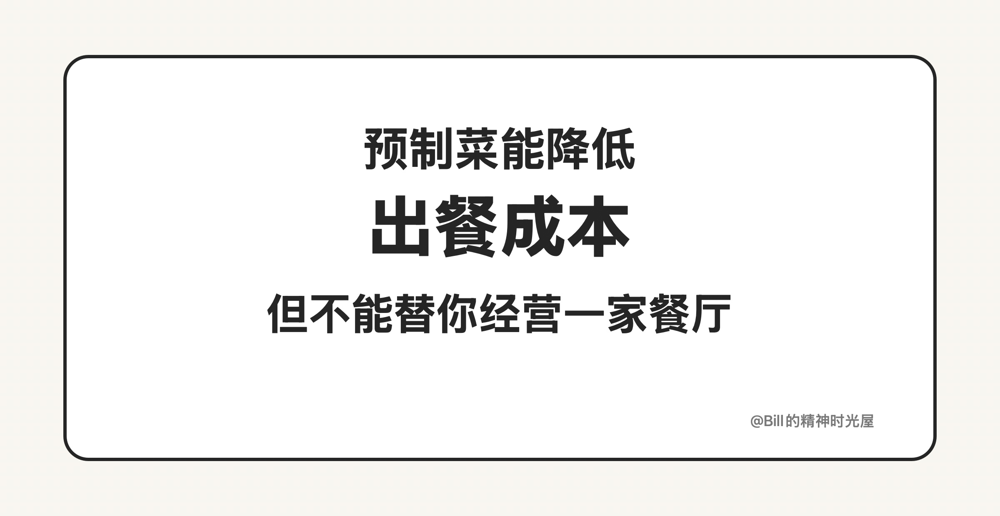
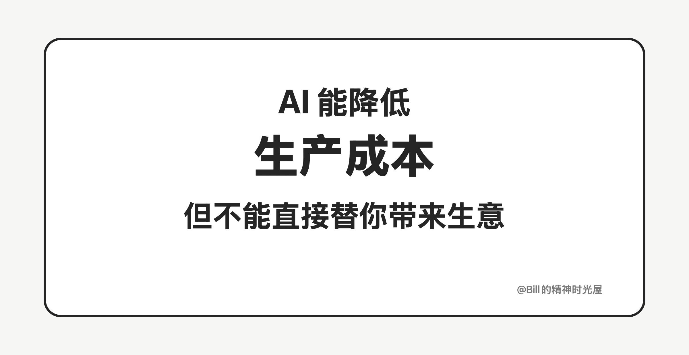

# 2026-03-17: 用了 AI，不等于有了生意

> TL;DR
>
> AI 能显著降低生产成本，但它不能替你完成定位、获客、转化和留存。**用了 AI，不等于有了生意。**

昨天我说，今天的 AI 就像当年的预制菜，最重要的不是观望，而是先用起来。这个判断没问题。但如果只停在这里，也容易让人产生一个错觉：好像只要把 AI 用上了，事情就成了。

其实不是。

没有一家餐饮店，只是因为用了预制菜就实现了盈利。预制菜解决的，是后厨效率、标准化和成本结构的问题。它可以让一家店备菜更轻、出餐更快、复制更容易，但它解决不了一家店真正的经营问题。你是做西餐还是中餐，做川菜还是粤菜，店开在哪里，主打什么价格带，靠什么吸引顾客，怎么让顾客愿意再来，这些才决定一家店能不能赚钱。预制菜很重要，但它从来不是盈利本身。

AI 也是一样。

今天很多人一提到 AI，就默认它会直接带来商业结果。好像只要会用 AI 写代码、做页面、出原型、搭应用，经济收益自然就会跟着来。但真实情况并不是这样。AI 解决的是“怎么更快、更便宜地做出来”，它并不直接解决“为什么用户愿意买单”。如果你对用户没有理解，产品定位不清楚，宣传触达不到人，留存做不起来，那你就算 100% 用 AI 把东西做出来，也不等于这件事能形成收入。

我自己的体感很直接。我确实已经用 AI 做了几个完成度很高的应用，几乎一行代码都没怎么写。这说明 AI 已经足够强，强到可以极大降低开发门槛和生产成本。但这恰恰也说明另一件事：当“做出来”越来越便宜之后，真正拉开差距的，反而不再是开发本身，而是你对用户、场景和生意的理解。你做给谁用，你解决什么问题，你怎么让别人知道，你怎么让别人留下来，这些问题，AI 不会替你回答。

所以我今天更想补上一句：**AI 能帮你更快进入牌桌，但不能保证你赢牌。**

它当然值得立刻用起来，而且越早用越好。但别把“用了 AI”误以为“有了结果”。预制菜改变的是出餐，不能替你经营一家餐厅；AI 改变的是生产，不能替你经营一门生意。

用了 AI，不等于有了生意。真正决定结果的，仍然是产品、用户和经营本身。
