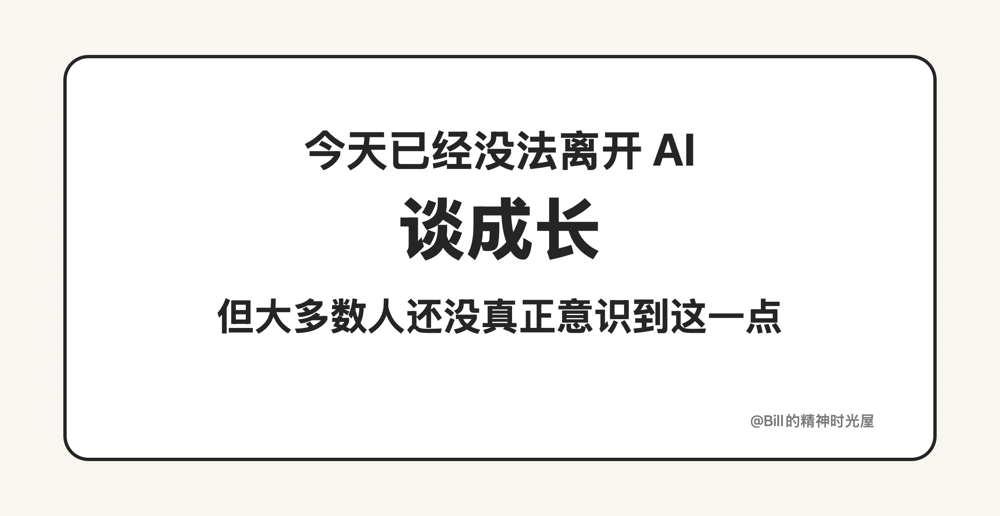
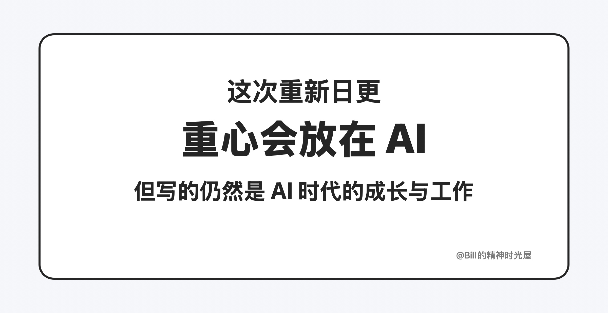

# 2026-03-18: 我为什么又开始日更这个公众号

> TL;DR
>
> 我重新开始日更，不是因为突然有了表达欲，而是因为 **AI 已经重要到没法绕开**。以后这里会更集中地写我对 AI 的理解，以及一些真正能用起来的方法。

我又开始日更这个公众号了。

这次重新开始，不是因为我突然想明白了怎么做内容，也不是因为我突然对日更这件事重新燃起了热情。更直接的原因是：**AI 现在实在太重要了。**

以前谈职业成长，还可以主要聊做事方法、沟通协作、个人习惯、成长心态。但今天如果还离开 AI 去谈成长，我会越来越觉得那是在绕开真正重要的东西。因为 AI 已经不只是一个新工具了，它正在直接改变一个人的工作方式、学习方式和产出方式。以后会用 AI 和不会用 AI 的人，差距只会越来越大，而且这种差距不是一点点效率差，而是整个能力结构的差距。

也正因为这样，我忍不住又开始日更了。AI 变化太快，新的理解、新的用法、新的工作流几乎每天都在冒出来。很多判断不是一次就能想清楚的，而是在不断使用、不断试错、不断观察里慢慢长出来的。对我来说，最合适的记录方式不是偶尔写一篇，而是持续地写，持续地整理，持续地把自己的理解沉淀下来。

所以接下来，这个号的内容也会更明确一些。我会更多写 AI，写我对 AI 的理解，写我在真实工作里怎么用 AI，也写那些我觉得真正有价值、能够直接上手的使用技巧。它当然仍然和成长有关，但已经不是过去那种离开 AI 的成长叙事了，而是更直接地去讨论：**在 AI 时代，一个人到底该怎么工作，怎么学习，怎么把自己真正放大。**

所以，如果你最近也越来越强烈地感觉到，很多事情已经没法绕开 AI，那接下来这里的内容，应该会比以前更值得持续看下去。
