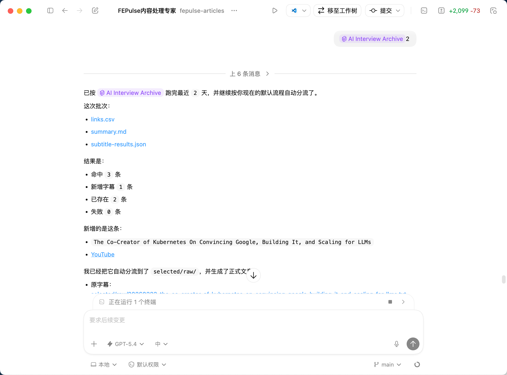
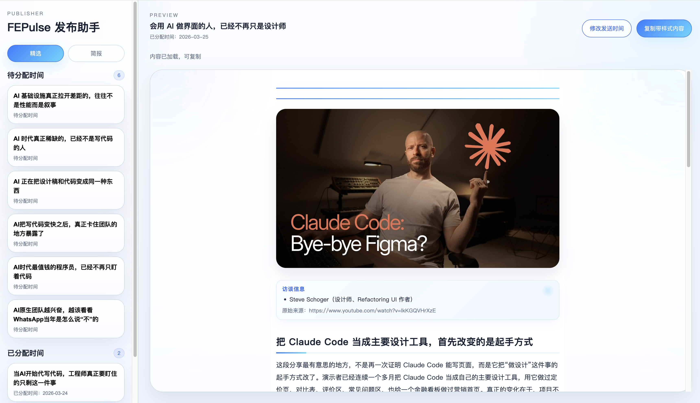

> TL;DR
>
> 我把一篇 AI 相关文章从“手工串流程 30 分钟”改造成了“执行一个 Agent，1 分钟出成品”。真正的变化，不是省了 29 分钟，而是把内容生产变成了一个会持续优化的系统。

这几天我写了一些偏理论和认知层面的文章，不过我不想把这个公众号做成一个只谈道理的号。道理当然重要，但如果没有实践，道理很快就会变轻。所以接下来我会持续掺杂一些真实案例，做到知行合一。今天这篇就是一个很具体的案例：**我如何把一篇符合我质量预期的 AI 相关文章，从原来大约 30 分钟的生产时间，压缩到现在 1 分钟以内，实际人为参与甚至不超过 30 秒。**

## 为什么我要做这件事

这两年，FOMO 这个词几乎被 AI 又重新带火了一次。FOMO 是 `Fear of Missing Out` 的缩写，中文通常翻成“错失恐惧症”。说白了，就是你总觉得外面正在发生一些重要的事，而自己一旦没有及时跟上，就会被甩下。

AI 的概念层出不穷，尤其是对技术人来说，体感会非常强。以前技术社区里还能看到不少和 AI 无关的文章，现在几乎无一例外都在谈 AI。每天都有新模型、新工具、新说法、新趋势，你稍微停一停，就会怀疑自己是不是又错过了什么重要信息。

我自己当然也有这个症状。所以我会时不时去刷一些海外前沿的资讯和分享，其中一个很重要的渠道就是 YouTube 上的前沿访谈。像 Hinton、Karpathy 这种行业大佬的访谈，信息价值很高，但问题也非常明显：一条视频往往就是一两个小时。让我完整花一两个小时去听一门英文课，坦白说，我很难长期坚持，而且这种信息接收方式的效率也太低。

于是问题就来了：**有没有一种更高密度、更低摩擦的方式，让我既不错过这些内容，又不用付出那么高的时间成本？**

## 我原来的做法是什么

我原来的流程，其实已经算是被我手工优化过一轮了。

第一步，我根据平时刷 YouTube 的经验，关注了一批我认为质量比较高的频道。每隔三四天，我会把这些频道重新打开，挨个看看距离我上次查看有没有新内容出来。这样我就能得到一批这几天刚更新的视频。

第二步，我使用 `yt-dlp` 这个工具把这些视频下载下来。

第三步，我再把视频上传到一个“视频转文字”的平台，拿到逐字稿。

第四步，我把逐字稿和一份提前写好的提示词一起发给 ChatGPT，让它帮我整理成一篇文章。

第五步，如果这篇文章要发到公众号，我还得再手动做排版统一，确保样式一致。这里我用的是 `mdnice`。

到这里，一篇公众号文章从零到发布的流程就走完了。

问题是，这整套流程虽然已经比“直接硬啃原视频”高效很多，但还是太繁琐了。每篇文章下来，基本还得耗费我半小时左右。而更让人难受的是，这里面绝大部分都不是高价值判断，而是机械性的体力活。

也就是说，我并不是在花 30 分钟思考，而是在花 30 分钟搬运。

## 第一个阶段：先把正反馈链路建立起来

我最早发现的，不是步骤多，而是另一个更本质的问题：**提示词是写死的。**

这意味着，除非我手动去维护它，不然我写第 1 篇文章和写第 100 篇文章，得到的结果本质上是一样的。这样的系统是不会成长的，它只能不断重复当前水平。

这就和我前几天写的那篇 [AI 时代，最重要的是让自己进入正反馈链路](./2026-03-22：AI%20时代，最重要的是让自己进入正反馈链路.md) 里说的是同一个问题：如果系统不会随着使用而变得更懂你，那你其实并没有真正进入正反馈。

所以我先做的第一件事，就是把“生文章”这个过程从 ChatGPT 网站搬回本地，用 Codex 来完成。提示词也不再散落在对话框里，而是放到本地文件中管理。

这样一来，后面如果我对某一篇文章不满意，我提出来的修改意见就不再只是“这次改一下”，而可以被 Codex 自动沉淀进提示词里，变成后续文章的默认要求。

这一步的意义非常大。因为从这一刻开始，我写得越多，系统就越懂我；文章产出得越多，质量就越容易往上走。文章不再是一篇一篇孤立地产出，而是变成了一个会成长的系统。

## 第二个阶段：把最笨重的步骤砍掉

接着我发现，原来“下载视频，再上传到转文字平台”这一步，还是太笨了。

于是我继续降低容忍阈值。既然这个步骤让我不舒服，我就不想继续忍着用。

后来我发现，YouTube 其实是可以直接爬到字幕文件的。问题只在于，以前每次都得我手动敲一长串命令，而且拿到的字幕文件里面还带着大量时间戳和各种无用信息，后面还得自己清洗。

于是我又 vibe coding 了一个网站。现在我只要粘贴一个 YouTube 视频链接，就能一键得到清洗好的字幕文件。

看起来只是省掉了一个中间步骤，但它本质上是在做同一件事：**把原来让我烦的机械工作，持续从流程里剔除出去。**

## 第三个阶段：不只是优化单点，而是把整条链路串起来

到这里，流程已经比最开始顺很多了，但我还是不满意。因为视频还是要我自己找，整个链路还是得我自己串。每篇文章虽然能做出来，但整个系统还远远谈不上自动。

所以我又继续做了第三阶段的升级。

我先写了一个 skill，名叫 ai-interview-archive。这个 skill 的作用很简单：自动爬取最新的 YouTube 视频。

最终效果就是，我只要执行类似 `/ai-interview-archive 3` 这样的命令，Codex 就能自动帮我把最近 3 天的新视频对应的字幕抓到本地。

但我没有停在这里。我又做了一个 `fepulse-articles` 项目，把这个能力继续往下接。

这个项目会先利用 `ai-interview-archive` 拿到最新字幕，然后继续做两件事：

第一，对内容做分类。因为公众号的读者主要是技术人，所以我不希望所有内容都一股脑儿塞给他们。技术人更可能关心的内容，就归到“精选”；技术人未必那么关心，但对我自己理解行业趋势还有价值的，就归到“简报”。

第二，针对不同类别，走不同的产出策略。

“精选”里的内容，会生成可以直接发到公众号上的长文；  
“简报”里的内容，则主要用于我自己快速阅读，所以我让 Codex 把它们整理成 500 字左右，让我可以更快把握趋势。

走到这一步之后，整个事情就变味了。它不再是“我手工整理一篇文章”，而是已经变成了一个内容生产系统。

## 最后的结果是什么

现在我的新流程非常简单：

执行一个 skill，  
打开一个成品网站，  
一键复制。

整个过程 1 分钟以内就能完成，而我真正动手参与的时间，很多时候甚至不超过 30 秒。

这 30 秒里，我做的不是机械劳动，而更多是选择和判断：这篇值不值得发，要不要进“精选”，有没有需要额外调整的地方。

这就是我最满意的地方。不是因为我“省了 29 分钟”，而是因为我终于把时间从机械流程里释放出来，放回到了更高价值的判断上。

## 这件事对我来说真正重要的地方

表面上看，这只是一个“内容生产提效”的案例。

但更深一层，它其实同时验证了我这几天一直在写的几件事。

第一，建立正反馈链路真的重要。  
如果提示词永远写死，系统就永远停在原地；只有让反馈不断沉淀进去，系统才会越跑越顺。

第二，降低容忍阈值也真的重要。  
如果我一直对那些让我不舒服的步骤忍一忍，那今天这一分钟的流程根本不会出现。

第三，AI 真正带来的变化，不只是“帮你做快一点”，而是**让你有机会把一整套原本需要人肉串起来的流程，重写成一个越来越自动、越来越懂你的系统。**

所以对我来说，这个案例最值得说的，不是“我又做了一个工具”，而是：**我正在把自己获取信息、整理信息、输出信息的方式，一点点改造成一个更高杠杆的系统。**

而这，才是我接下来会不断分享这些案例的原因。
