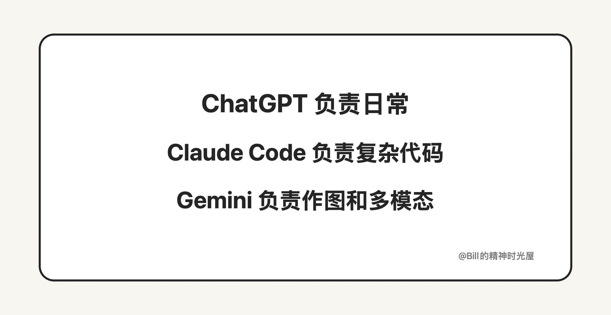
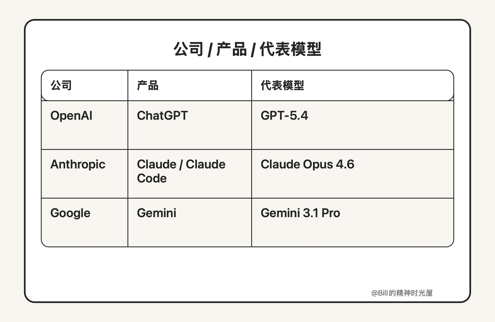

> TL;DR
>
> 现在最值得关注的第一梯队 AI 产品，基本还是 ChatGPT、Claude、Gemini。真正高效的用法，不是反复问谁绝对最强，而是搞清楚它们各自强在哪，再按场景分工使用。

前两天我说过一句话：有条件就尽量用最顶级的 AI。

这里的“最顶级”，业内一般会说是 State of the Art，缩写成 SOTA。你不用把这个词想得多神秘，简单理解就是：在当前这个阶段，最能代表能力上限的一批 AI 产品和模型。

现在如果只看今天最常被第三方横评机构放在第一梯队比较的 AI 产品，我觉得基本还是绕不开 3 个：ChatGPT、Claude、Gemini。它们背后的代表模型，长期都在几类核心横评里反复出现在前排。比如 LMSYS Arena 这类偏用户真实偏好的榜单，Artificial Analysis 这类综合能力横评，以及 SWE-Bench、Terminal-Bench 这类更偏编程和长链路任务的榜单，第一梯队长期都被这三家占着。

很多人最喜欢问的问题是：到底哪个最强？

但我的感受是，这个问题本身就有点问偏了。因为现在真正高效的用法，不是反复争论谁绝对最强，而是先搞清楚它们各自强在哪，然后按场景分工。

先说 ChatGPT。如果只说一个我平时用得最多的 AI，那一定是它。原因很简单：综合能力最均衡。日常办公、写作、整理、总结、一般代码场景，基本都能接住。它最强的地方，不一定是某一个单项断档领先，而是你很难找到明显短板。还有一个特别现实的优点：稳定。至少不用担心今天还聊得好好的，明天账号突然没了。对我来说，如果日常只能常开一个窗口，我大概率还是留 ChatGPT。

再说 Claude。如果 ChatGPT 更像综合选手，那 Claude 更像重型选手，尤其擅长复杂任务、长链路任务和代码场景。而如果进一步落到编程领域，Claude Code 基本就是现在公认的最强形态之一。像 Claude Opus 4.6 这样的旗舰模型，之所以在程序员圈里声量这么高，不是因为包装做得好，而是因为在很多第三方编程和长任务评测里，它确实长期在第一梯队。真正复杂的代码、多轮协作、需要持续推进的任务，我现在还是更倾向交给它。但它的问题也很明显：风控和封号很烦。我自己已经被莫名其妙封过好几个号。所以它很强，但稳定性确实让人头疼。

再说 Gemini。如果让我只用一句话概括它的优势，那就是：多模态。很多时候，Gemini 最强的地方不在普通问答，而在图片、视觉信息、媒体内容这些场景。Google 这条线最有辨识度的，也正是多模态能力。无论是看图、作图，还是理解更复杂的视觉信息，它给我的感觉都比很多产品更直接。所以我自己一般拿它来作图，或者处理一些跟图片和视觉相关的任务。

所以如果问我现在怎么分工，其实很简单：

- ChatGPT 负责日常办公、写作、整理、一般代码
- Claude Code 负责复杂代码和长链路任务
- Gemini 负责作图和多模态

最后补一个最实用的表。如果你想把产品、背后的公司和当前比较有代表性的顶级模型快速对上，可以先看这个：

不一定非得把这些产品和模型都用上，但如果一个都没有真正长期用过，其实很难说自己一直贴着前沿在走。更重要的也不是背下几个模型名，而是开始把这些前沿能力真正接进自己的工作流。
