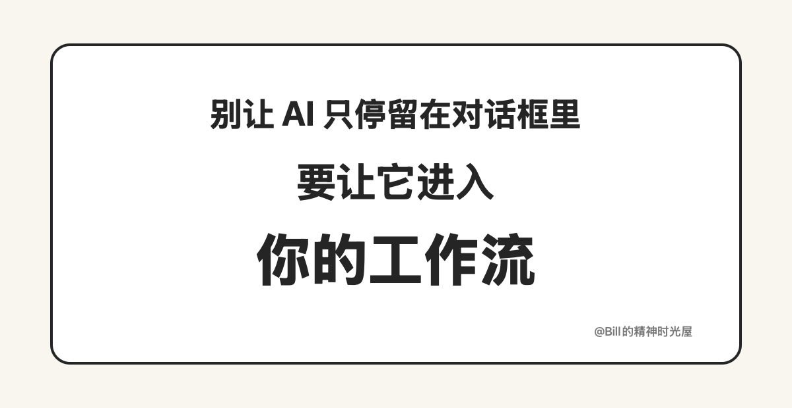

> TL;DR
>
> 很多人已经在用 AI 了，但 AI 还只停留在对话框里。真正大的变化，不是它偶尔帮你答一个问题，而是它开始进入你的工作流，持续帮你把事情往前推。

很多人现在其实已经在用 AI 了。平时问个问题、润色一段话、让它帮忙起个标题，聊得挺热闹。但问题是，AI 还只停留在对话框里。

这当然不是说对话框没用。对话框是最容易上手的入口，很多人第一次感受到 AI 的能力，也都是从这里开始的。但如果一直停在这里，AI 的价值其实只被用了很小一部分。它更像一个随叫随到的问答助手，而不是你做事流程里真正的一部分。

我自己最明显的感受，就是写公众号这件事。以前如果只是开着聊天框，让 AI 帮我改一句话、起一个标题，它当然也能帮上忙，但本质上还是“聊一下”。后来我把它慢慢接进整个流程：整理思路、生成文章、出配图、做预览页，甚至把一些固定偏好沉淀下来。到了这一步，AI 的价值就不再是回答一个问题，而是持续帮我把一件事往前推。

再比如我前面写过的 YouTube 访谈整理。最开始也可以直接把一段字幕丢进聊天框，让 AI 帮我总结。但后来我发现，真正有价值的不是“总结这一次”，而是把下载字幕、清洗文本、生成文章、不断吸收我新要求这一整条链路串起来。这样它才不是一次性的问答工具，而是一个会越来越懂我的系统。

很多人之所以一直停留在对话框阶段，一个很大的原因是，对 AI 的理解还停留在 ChatGPT、豆包、元宝这样的聊天框里。好像用了聊天产品，就等于已经把 AI 用起来了。其实不是。聊天框只是入口，不是终点。

真正能把差距拉开的，是你有没有开始让 AI 离开对话框，进入你的真实工作流。它可以是一个写作流程、一套信息整理流程、一个代码流程，甚至只是你每天都会重复做的某个动作。只要它开始稳定地帮你接住这些事，AI 才算真正进入了你的系统。

所以我现在越来越觉得，AI 最容易被浪费的地方，就是永远只待在对话框里。聊得再多，也不等于用得够深。真正重要的，是让 AI 从一个聊天对象，慢慢变成你流程里的一部分。
