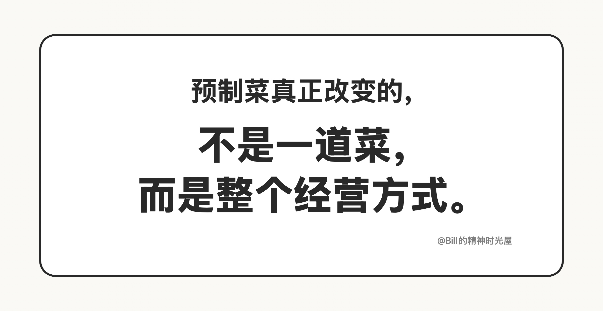
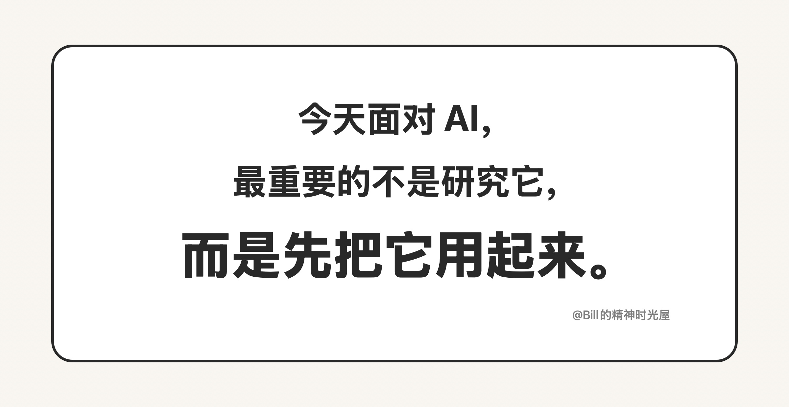

# 2026-03-17: 今天的 AI，就像当年的预制菜

> TL;DR
>
> 今天面对 AI，最重要的不是研究、观望和争论，而是三个字：**用起来。**

今天的 AI，我觉得就像当年的预制菜。预制菜刚出来的时候，一个餐饮店老板最重要的判断，不是它纯不纯、正不正宗，也不是先研究它到底怎么做出来的。对老板来说，真正重要的问题只有一个：**它能不能帮我降低成本、提高效率、把生意做得更轻。**

预制菜为什么厉害？因为它先改变的不是味道，而是流程。原来一家店要稳定出餐，得靠后厨、靠师傅、靠现场处理，还得扛住高峰期的人手压力。预制菜一进来，很多事情都变了。备菜更省事了，出餐更快了，标准更统一了，对人的依赖也更低了。它不一定让每一家店都变得更高级，但它很可能让一家店变得更轻、更稳、更容易复制。

这就是预制菜真正有杀伤力的地方。它不是在“提升一道菜”，而是在重写一套经营方式。你可以不喜欢它，但只要它已经能明显改变成本结构和经营效率，真正有经营头脑的人就不会只站在旁边争论，而会先做一件事：**把它用起来。**

AI 也是一样。今天很多人面对 AI，还是在围观，在观望，在研究原理，在等它“更成熟”。但这件事的重点根本不在那里。AI 正在重写软件开发、内容生产和信息处理的成本结构。这个时候，最重要的不是你对 AI 有没有完整理解，而是它有没有进入你的工作流、进入你的业务、进入你的赚钱方式。

我自己的感受很直接。我已经做了几个完成度很高的应用，一行代码都没有写。到了这个阶段，再去讨论 AI 到底完不完美，其实已经不重要了。它最现实的价值，就是已经能拿来干活，已经能帮你把过去高门槛、高成本的事情做出来。

所以今天谈 AI，我的观点很简单：它就像当年的预制菜。面对这种东西，最重要的从来不是研究它，而是先把它接进自己的业务里。

答案就三个字：**用起来。**
