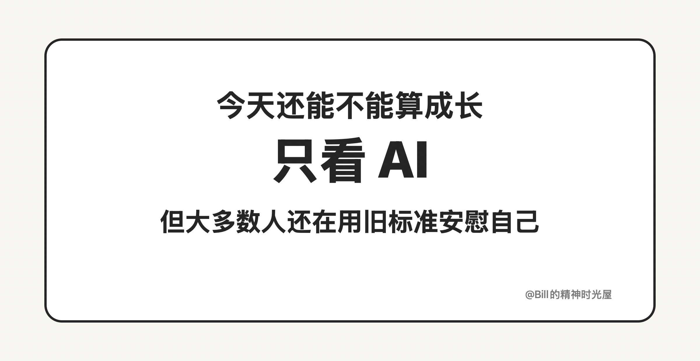
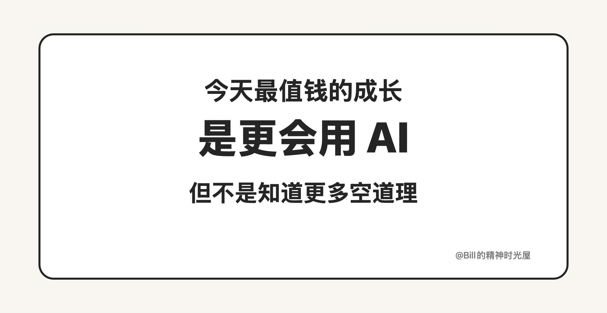

# 2026-03-20: 判断自己是否成长，只看 AI 就够了

> TL;DR
>
> 今天判断自己有没有成长，最简单也最残酷的标准，就是看你对 **AI 的理解有没有更深一点，使用 AI 的能力有没有更强一点**。如果这两件事没有变化，别的“成长”都不算数。

判断自己有没有成长，其实只需要看一件事：**你今天对 AI 的理解是不是比昨天更多了一点，你今天使用 AI 的能力是不是比昨天更强了一点。**

如果答案是否定的，那很多我们过去习惯拿来安慰自己的东西，严格来说都不太算成长。你今天看了几篇文章，听了几期播客，做了几页笔记，开了几个会，甚至忙了一整天，这些都可能只是信息流过了一遍你的身体，并没有真正改变你的能力结构。今天真正能把一个人和昨天拉开差距的，不是“又懂了一点泛泛的道理”，而是你有没有更靠近 AI 一点。

因为现在的 AI，已经不是一个边角料技能了。它正在直接改写一个人的工作方式、学习方式和产出方式。你对 AI 的理解更深一点，你就更知道它能做什么、不能做什么、应该怎么配合你；你使用 AI 的能力更强一点，你就更可能把同样的时间，换成更高质量的结果、更快的交付速度和更大的产出杠杆。这个变化不是抽象的，而是每天都会累积的。

反过来说，如果你今天仍然完全没有建立起对 AI 的判断，也没有把 AI 真正接进自己的工作流，那你所谓的成长，很可能还停留在旧时代的坐标系里。你看上去也在努力，也在输入，也在积累，但这些积累未必还能有效转化成未来的竞争力。因为接下来真正决定差距的，不再只是“你会不会”，而是“你会不会借助 AI 去放大自己”。

所以我现在给自己定的标准非常简单：每天都要在 AI 上往前走一点。可以是多理解一个模型的边界，可以是多掌握一个工作流，可以是多试出一种更顺手的用法，也可以是多形成一个更清晰的判断。只要你在这件事上持续往前，你的成长就是实打实的。

今天判断自己是否成长，只看 AI，就够了。
