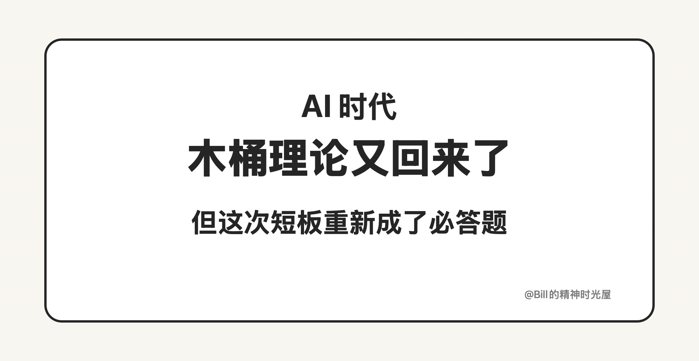
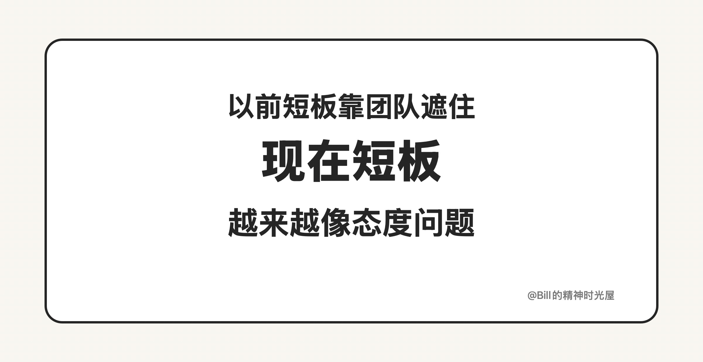

# 2026-03-21: AI 时代，木桶理论又回来了

> TL;DR
>
> 以前工作里大家总说要看长板，短板可以靠团队协作补上。但到了 AI 时代，很多短板第一次变得可以低成本补齐，于是短板重新变成了必答题。

我们从小听到大的一个词，就是木桶理论。老师总说，决定你成绩的不是最强的那门课，而是最差的那门课。那时候这句话特别有道理，因为考试看的是总分，偏科越严重，越容易被短板拖住。

但工作以后，很多人又会自然走向另一个判断：木桶理论没那么重要了。因为工作不是考试，工作讲究分工和协作，一个团队里有人擅长表达，有人擅长执行，有人擅长分析，有人擅长技术。这个时候，一个人最重要的往往不是把所有短板都补齐，而是把自己的长板做深，做出不可替代性。所以过去这些年，大家越来越相信一句话：**别老想着补短板，先把长板拉满。**

这句话在过去没问题，但到了 AI 时代，情况开始变了。

因为 AI 第一次让“补短板”这件事变得足够便宜，也足够现实。以前不会写代码，就是不会；不会做图，就是不会；不会表达，不会分析，不会总结，很多时候都只能长期认命，再交给别人补位。但现在不一样了。写作差，可以借 AI 补表达；不会做图，可以借 AI 出视觉；不会写代码，可以借 AI 先把产品做出来；不会整理研究，也可以借 AI 帮你提炼和归纳。也就是说，很多过去天然合理的短板，现在开始变得没那么合理了。

这件事最关键的变化在于：**AI 让短板不再只是能力问题，而越来越像态度问题。**  
以前你可以说“我不会”，因为真的很难补；现在你还长期停在“我不会”，就越来越像“我不想补”“我懒得补”“我还停留在旧时代的工作方式里”。

所以 AI 时代，不是简单回到了学生时代那种木桶理论，而是重新定义了什么叫短板。过去短板可以长期外包给组织和协作，今天很多短板都在被 AI 重新拉回个人面前。你当然还是要有长板，但只靠长板已经不够了。未来更占优势的人，不只是有一块特别长的板的人，而是那些一边保留长板，一边借 AI 迅速把短板补到不拖后腿、甚至可以独立完成更多事情的人。

以前短板可以被团队掩护，今天短板越来越会暴露一个人的上限。因为 AI 已经把补短板这件事，从可选项，变成了必答题。
