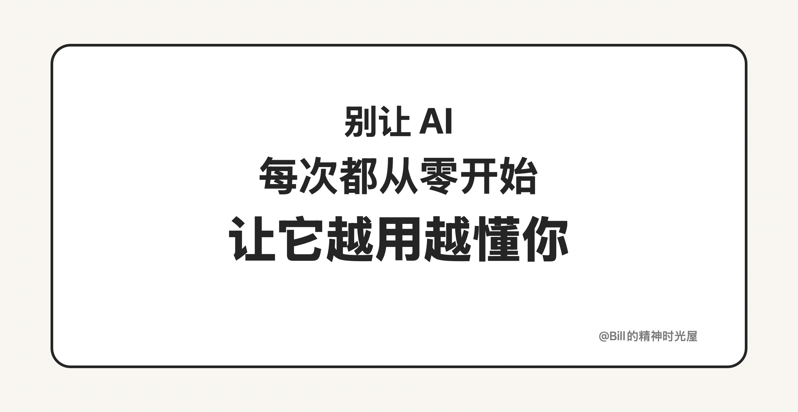
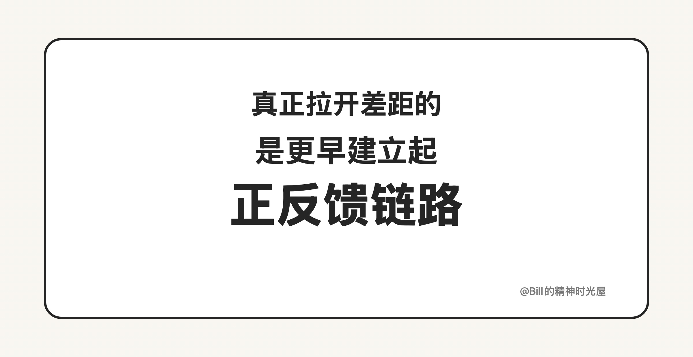

# 2026-03-22: AI 时代，最重要的是让自己进入正反馈链路

> TL;DR
>
> AI 时代，真正拉开差距的，不是谁多做了一次，而是谁更早建立起自己的正反馈链路。**别让 AI 每次都从零理解你。**

我现在越来越强烈地觉得，AI 时代一个人最重要的能力之一，就是让自己进入正反馈链路。

我举一个最近很具体的例子。YouTube 是我了解全球最前沿那帮人最近在 AI 上到底在做什么的重要渠道之一，但问题也很明显：很多访谈动不动就是 1 到 2 个小时。对我来说，这种长度几乎不可能成为一种稳定习惯。我不会真的每天花几个小时去看一个长视频。

所以我做了一件事：让 AI 给我 vibe coding 了一个小工具，先把 YouTube 视频的字幕下载下来，然后再配合我提前写好的提示词，让 AI 帮我做总结和提炼。这样一来，原本要花 1 到 2 小时才能大致了解的内容，我现在通常 10 分钟以内就能看完核心内容。

但后来我发现，真正的问题根本不在“能不能总结”，而在于这个流程还不够聪明。因为提示词是写死的。每次我有了新的想法、新的要求，我都得把原来的提示词重新喂给 AI，再补一句“这次还要加上这个要求”。这样当然也能做，但效率很低，而且意味着系统没有成长，AI 也没有随着我的使用变得更懂我。

更高效的方式应该是：当我在看某一篇总结结果时冒出了新的要求，AI 不只是执行这一次要求，而是应该把这个新要求自动吸收到我原来的提示词体系里。这样下一次开始，它就已经带着新的理解在工作了。你用得越多，它越懂你；你生成的内容越多，它越接近你真正想要的样子。它不应该是你看第一篇的时候一个样，看第 365 篇的时候还是一个样。

这其实就是一个很小的正反馈链路：你先让 AI 把一个高摩擦任务降到可做，再让它在每次使用里不断吸收你的新判断，最后让整个系统越跑越顺。AI 时代最可惜的，不是没用 AI，而是用了 AI，却只把它当成一次性工具。真正重要的，不只是让 AI 帮你把事情做完，而是让它在一次次协作中越来越懂你、越来越适配你、越来越能放大你。

以前复盘是一件很重的事，优化是一件很慢的事；但在 AI 时代，复盘可以很轻，优化可以很快。谁能更早让自己进入这种持续优化的正反馈链路，谁就更有可能真正把 AI 变成自己的长期优势。
