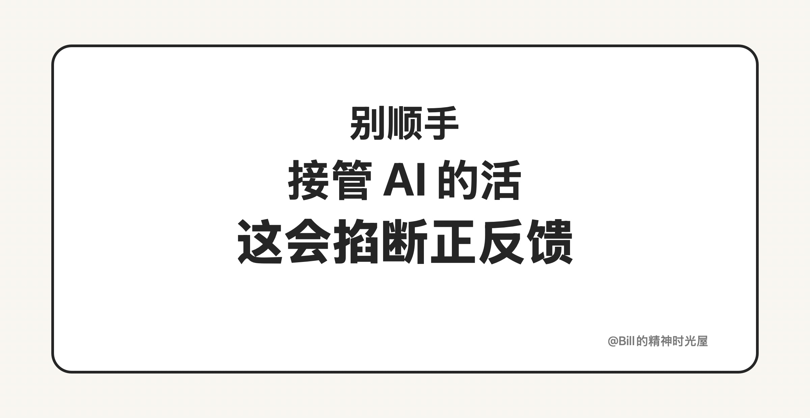
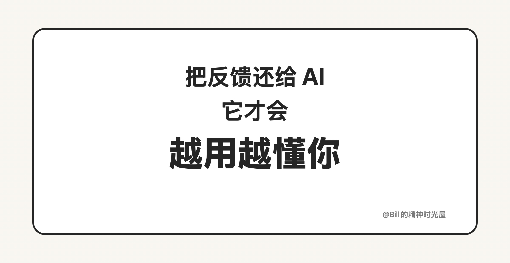

<!-- article_id: art_54a31dd1c9dd -->
# 2026-03-23: 别顺手接管 AI 的活

> TL;DR
>
> 建立正反馈链路的一个重要提醒是：**别发现 AI 做得不够好，就自己顺手改掉。把反馈还给 AI，才会让它越来越懂你。**

建立正反馈链路，有一个很容易被忽略的提醒：**不要发现 AI 做得不够好，就自己顺手改了。**

这件事太容易发生了。比如上一篇我讲到，我会让 AI 帮我整理 YouTube 长访谈、提炼核心内容、生成文章。可当 AI 生成出来的东西不够好时，很多人的第一反应不是继续跟 AI 说清楚，而是“算了，我自己顺手改一下更快”。写文章是这样，改文案是这样，调结构是这样，做代码、做设计、做总结也都是这样。

但问题就在这里。你顺手改掉，当然能把这一次做完，可你也顺手掐断了一次正反馈。因为这意味着：AI 没有得到新的反馈，它不知道自己到底哪里做错了，也不知道你真正想要什么。于是下一次，它还是那个水平；第十次，它还是那个水平；第 365 次，它可能还是那个水平。表面上你是在提效率，实际上你是在让自己永远重复当那个兜底的人。

真正更值钱的做法，不是你亲手把这一次修漂亮，而是把你的修改意见重新讲给 AI，让它吸收进去。让它知道这句为什么不对，这一段为什么太平，这个结构为什么不顺。只有这样，你和 AI 的协作才会越来越顺，下一次的初稿才会更接近你想要的样子。**正反馈链路的关键，不是你改得快，而是 AI 学得快。**

所以，建立正反馈链路的一个重要提醒就是：别顺手接管 AI 的活。你每一次懒得讲清楚，都是在放弃一次让系统升级的机会。真正会把 AI 用得越来越顺的人，不是每次都自己补锅的人，而是愿意把反馈还给 AI，让它一轮一轮变得更懂自己的人。
