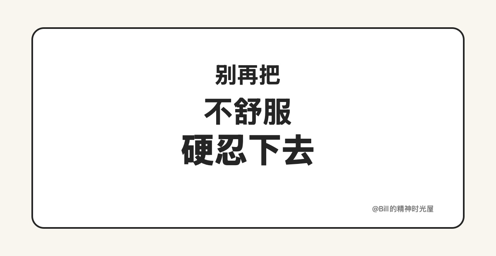
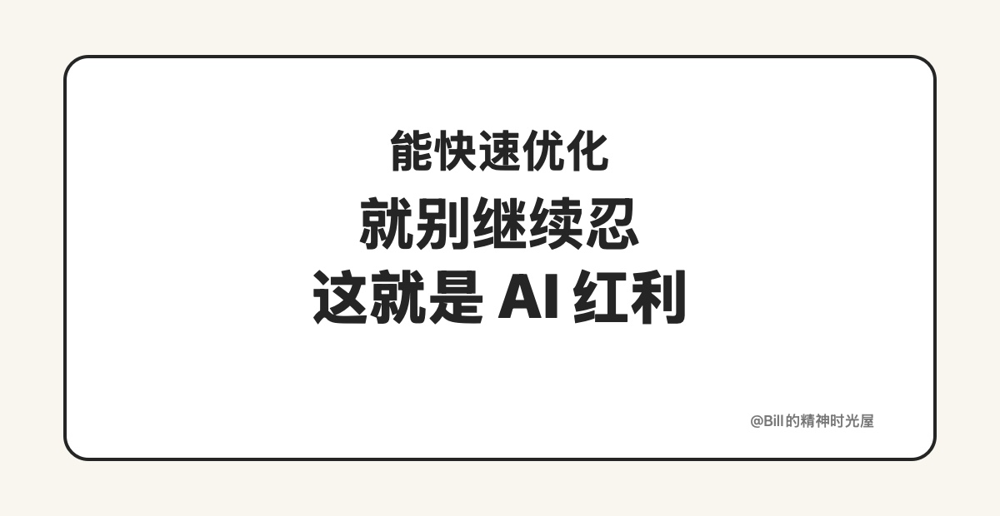

<!-- article_id: art_e5ee0c17e3f8 -->
# 2026-03-24: AI 时代，应该降低自己的容忍阈值

> TL;DR
>
> AI 时代，一个很重要的变化是：**要主动降低自己对“不舒服”的容忍阈值。**很多以前忍一忍就算了的问题，现在其实都可以很快被优化掉。

我越来越强烈地觉得，AI 时代，一个人应该主动降低自己的容忍阈值。

以前我们在工作和生活里遇到一些让自己不舒服的点，往往会选择忍一忍。因为很多事情就算看出来不对劲，改起来也很麻烦，沟通成本高，试错成本高，最后只能告诉自己一句：算了，先这样吧。久而久之，人就会形成一种习惯，不是把事情做得更好，而是不断提高自己对粗糙、不顺、低效的容忍度。

但 AI 时代不一样了。很多过去很贵的优化动作，现在已经变得很便宜。表达不够准，可以立刻重写；结构不够顺，可以立刻重排；流程有卡点，可以立刻补一个小工具；一个让你不舒服的细节，过去也许要忍半个月，现在可能十分钟就能修掉。这个时候如果你还在忍，很多时候不是因为没办法，而只是因为惯性太强。

比如写文章这件事，以前如果我觉得一句话不够硬、一段结构不够顺，可能会想：算了，差不多能发就行。因为真要继续改，意味着再想一遍、再写一遍、再磨一遍，成本不低。但现在不同了。AI 已经把“继续优化一下”这件事的门槛大幅打下来了。很多本来会被我忍掉的问题，其实都可以马上再试一版、更狠一版、更顺一版。这个时候如果我还继续忍，那损失的就不只是眼前这几分钟，而是我对作品质量的要求，和我把事情做得更好的机会。

所以我现在越来越觉得，AI 时代真正重要的，不只是多做事，而是更快发现那些让你不舒服的点，然后立刻把它们优化掉。以后真正把事情做得更好的人，往往不是更能忍的人，而是那些已经不愿意再忍本来就可以被优化掉的问题的人。
