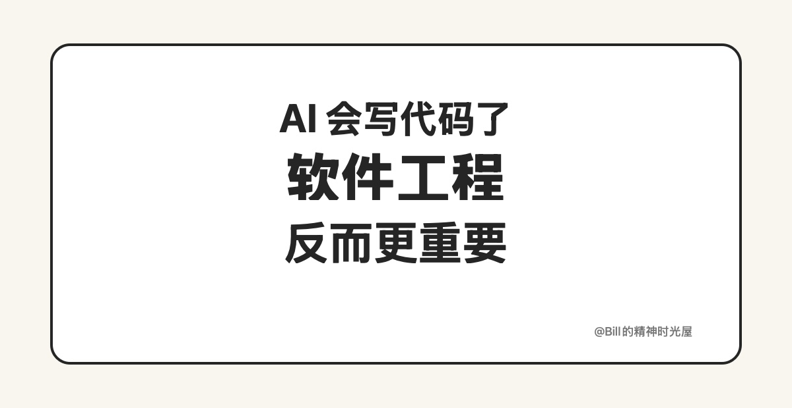
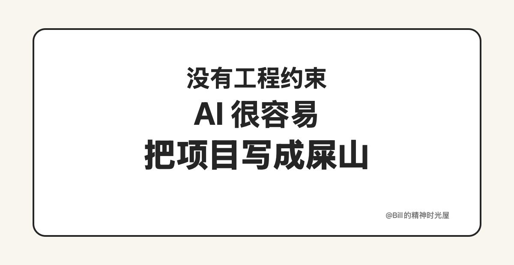

> TL;DR
>
> 很多人以为 AI 会写代码了，软件工程就不重要了。我正好相反地觉得，**软件工程在 AI 时代比以往任何时候都更重要。**

今天面试快结束的时候，我按惯例礼貌性地让候选人问我一个问题。对方最后问我：“对我有什么忠告？”

忠告谈不上。看他也是计算机专业的学生，我就跟他聊了聊我现在对 AI 的一个判断：**很多人以为 AI 会写代码了，所以软件工程不重要了，但我觉得恰恰相反，软件工程在 AI 时代比以前更重要。**

这几年只要稍微玩过一点 vibe coding，大概率都会有一种很强烈的感受：让 AI 帮你做个网站，已经不难了；让它帮你写一个小 App，也不是什么特别稀奇的事。你给它一个需求，它很快就能给你生成一个“能跑起来”的东西。很多人也因此会得出一个很自然的结论：既然 AI 已经能写代码了，那以后是不是更不需要在意什么工程、设计、架构这些“慢”的东西了？

我觉得这是一个非常危险的误解。

因为 AI 最擅长的，是把一个局部任务快速完成；但项目真正难的地方，从来都不是“写出一段代码”，而是**让一堆代码在复杂约束下长期可维护地长下去。**

只要你真的拿 AI 去做过稍微复杂一点的项目，就很容易发现一个问题：项目一开始很顺，越往后越容易乱。前面几个页面、几个接口、几个功能点都挺丝滑，但随着需求一点点叠加，AI 生成的代码大概率会慢慢变成“屎山”。不是因为 AI 笨，而是因为它在有限上下文里，天然倾向于用**最快、最直接、最局部最优**的方式把眼前的任务完成。

而这种完成方式，往往缺乏整体设计。今天多补一个判断，明天多复制一段逻辑，后天再加一层兼容。每一步看都合理，但累计起来，技术债就会越滚越大。最后你会发现，AI 不是没把功能做出来，而是把功能做出来的同时，也把整个项目的秩序一点点打碎了。

所以我现在越来越觉得，软件工程在 AI 时代不是变轻了，而是变重了。因为以前软件工程更多是在约束人，现在它开始越来越多地承担“约束 AI”的角色。你要先把边界划清楚，把模块关系设计好，把目录结构、依赖方式、接口约束、测试策略这些框架先搭出来，然后再让 AI 在这个预期内去改、去写、去补。

只有这样，AI 才更像一个高产的工程师，而不是一个随时可能把房子越修越歪的施工队。

这也是为什么今年 `Harness Engineering` 这个概念越来越火。大家慢慢意识到，真正重要的不是“让 AI 写代码”，而是**怎么给 AI 搭好 harness，给它足够清晰的约束、轨道和工作边界，让它在框架内高效地产出。**

说到底，AI 让“写代码”这件事越来越便宜了，但也正因为如此，真正拉开差距的能力就不再只是写，而是：你有没有能力把一个系统设计得足够清楚，让 AI 能持续在里面稳定工作。

所以如果今天还有计算机专业的学生问我有什么建议，我不会说“赶紧学会让 AI 替你写代码”就够了。我更想说的是：**越是 AI 会写代码的时代，越要认真学软件工程。**
