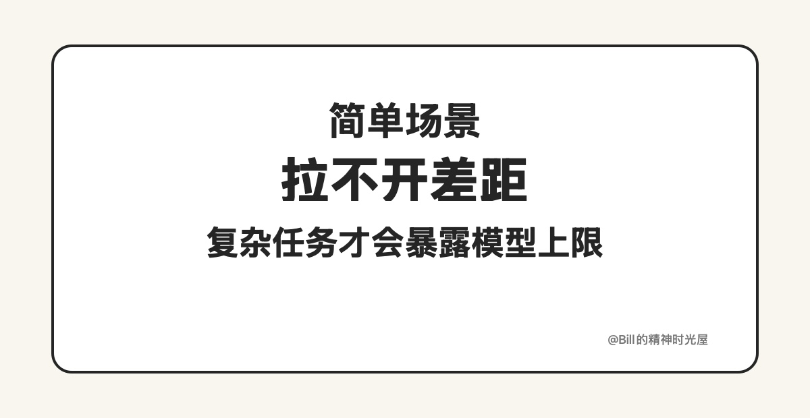
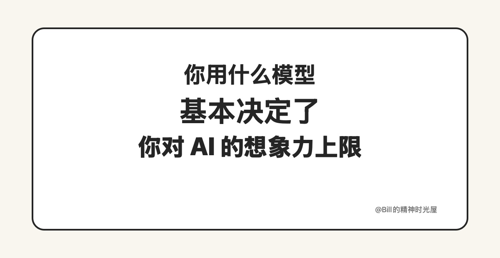

<!-- article_id: art_5bc80dc766fe -->
> TL;DR
>
> 国内大模型和海外最顶级模型，今天依然有明显差距。很多人感觉不到，不是因为差距真的小，而是因为自己给 AI 出的题太简单。**有条件，就尽量去用最顶级的模型。**

不得不承认，国内的大语言模型和海外最顶级的那一批相比，今天还是有一大截差距。

有的人会觉得问题不大，甚至会说“都差不多能用”。但我越来越觉得，这种判断很多时候不是因为差距真的小，而是因为自己用 AI 的场景太简单。

你可以想象一下：给一个数学博士和一个中学生，同时出一道两位数乘法题，他们做出来的结果当然差不了太多。不是因为两个人水平接近，而是因为题目本身太简单，简单到不足以拉开差距。

模型也是一样。你让它润色一句话、翻译一小段内容、总结几句短文字，很多模型看上去都还不错。但一旦进入真实工作，差距马上就出来了。

比如拆复杂需求，普通模型往往只能列表层，顶级模型更容易把隐藏约束和边界条件一起拆出来。比如写代码，简单 demo 看起来都行，但一旦项目复杂起来，普通模型更容易乱改、重复、堆技术债，顶级模型更容易保持整体一致性。再比如整理长访谈、长文档，普通模型经常只能做“表面摘要”，顶级模型更容易抓住真正重要的观点和结构。

所以真正重要的，不是“它能不能回答”，而是：**它能不能在复杂、真实、连续的场景里，持续给你高质量结果。**

这时候再看成本，很多人其实是在省小钱、误大事。与其一分钱不花，天天跟一个 60 分的人来回折腾，为什么不多花一顿饭钱，直接找一个 90 分的人把事做对？

尤其这个 90 分的人还是 24 小时待命的。你随时都可以让它帮你写、帮你拆、帮你改、帮你想。那这笔钱很多时候根本不是成本，而是这个时代最便宜的杠杆之一。

很多人不是低估了 AI，而是根本没用过真正强的 AI。

所以有条件的话，就尽量去用最顶级的大模型。不是为了炫耀，也不是为了追新，而是为了尽可能站在离未来更近的位置上。
