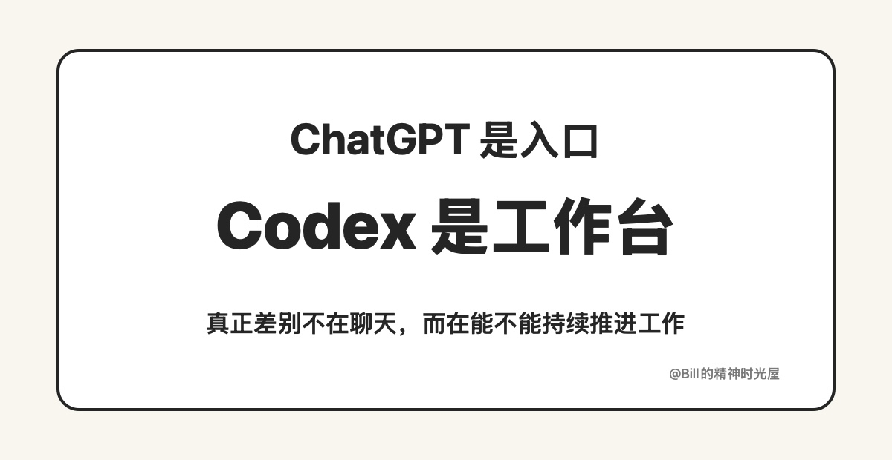

> TL;DR
>
> 不是 ChatGPT 不重要了，而是当 AI 真正进入生产过程之后，单纯的聊天框开始显得太轻了。ChatGPT 更像入口，Codex 更像工作台。

昨天我说，别让 AI 只停留在对话框里。顺着这个话题往下聊，我自己这段时间最明显的变化就是：自从开始大量使用 Codex 之后，ChatGPT 的使用频率明显下降了。

先简单说一下什么是 Codex。你可以把它理解成一个不只是陪你聊天、而是能直接进工作区帮你干活的 AI。它可以读文件、改内容、跑任务、持续迭代，所以它更像一个工作台，而不是一个单纯的聊天框。

这不是因为 ChatGPT 不行了。恰恰相反，ChatGPT 仍然是一个非常强的产品。很多开放问题，比如想法发散、思路拆解、方案比较、观点组织，它依然很好用。像 Projects 这样的能力，也是在尽量减少“每次新开对话都从零开始”的问题。但我的感受是，它本质上还是在增强聊天框，不是把 ChatGPT 彻底变成一个工作环境。

很多事情放在 ChatGPT 里，聊的时候当然很顺，可一旦离开对话框，很多状态、文件、约束、历史决策，还是不够自然地沉淀下来。它更像即时智力，而不是一个持续演化的生产环境。

Codex 给我的感觉就不一样了。它不是只陪我把事情聊明白，而是真的能直接往前做。这样一来，AI 的能力就不再只存在于上下文窗口里，而是能真正沉淀到文件、脚本、目录结构和工作流里。很多原本在 ChatGPT 里完成的事，迁移到 Codex 之后，就从“聊完了”变成了“做下去了”。

我现在越来越觉得，两者的差异可以这样理解：ChatGPT 更适合开放问题，Codex 更适合封闭目标。前者擅长“怎么想”，后者更擅长“怎么落”。前者像把 AI 带到人面前，后者像把 AI 带到工作里面。你当然还是会需要 ChatGPT，但当任务开始进入真实生产过程，单纯的聊天框就会显得太轻。

所以不是我不用 ChatGPT 了，而是很多原本在 ChatGPT 里完成的事，正在迁移到 Codex。因为 AI 真正值钱的地方，不只是跟你聊，而是能不能进入你的工作流，被持续积累、持续迭代、持续放大。
