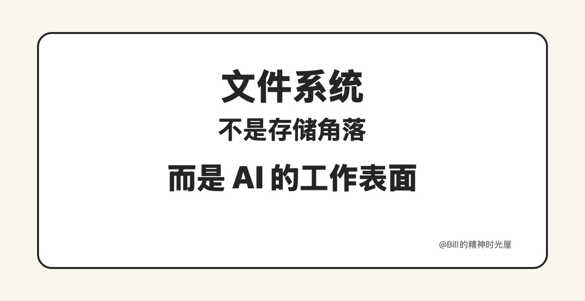

<!-- article_id: art_8f6b8dac1835 -->
> TL;DR
>
> AI 时代，文件系统之所以重要，不只是因为它能存东西，而是因为文件天然适合被 AI 读取、修改、比较、沉淀和持续迭代。很多真正高价值的 AI 工作流，最后都会落到文件系统上。

昨天我说，别让 AI 只停留在对话框里。顺着这个话题继续往下聊，我越来越强烈的一个感受是：**AI 时代，真正被低估的是文件系统。**

很多人一提到文件系统，第一反应还是“存东西的地方”。但在 AI 时代，文件系统早就不只是存东西了。聊天框当然也有价值，可它更像一个入口；文件系统不一样，它更像 AI 真正开始干活的地方。AI 一旦能直接面对文件、目录、脚本、配置和文档，它的角色就会从“陪你聊”变成“帮你做”。

## 为什么文件天然对 AI 友好

**第一，文件是可持久化的。**

聊天框里的很多信息聊完就散了，你今天说过什么、昨天定过什么规则、上周改过什么方案，过几轮之后就会越来越模糊；但文件不是，写进文件之后，它就稳定地留在那里。提示词、规则、脚本、文档、配置、代码、历史决策，都可以沉淀成长期资产。

**第二，文件是可读可改的。**

AI 最擅长的事情之一，就是读文本、理解结构、按要求修改，而文件刚好就是最适合 AI 接手的对象。一个目录、一批 Markdown、一套脚本、一组配置文件，对 AI 来说都比一段临时聊天记录更容易进入和接管，因为文件本身就是稳定对象，不需要先靠聊天去“回忆我们刚才说到哪”。

**第三，文件是可迭代的。**

文件可以不断修改、比较、覆盖、拆分、合并，再配合 Git 这样的版本管理工具留下清晰的演进痕迹。这样一来，对人来说，事情能持续变好；对 AI 来说，它每次也不是从零开始，而是能在已有成果上继续往前推。

**第四，文件能形成工作流。**

文件一旦进入目录结构，工作流就开始成立了。AI 不再只是回答一个问题，而是能围绕文件持续做事：读文件、改文件、补文件、整理目录、更新规则、串起脚本。到了这一步，AI 就不再只是“陪你聊一下”，而是在真的进入你的生产过程。

很多人觉得自己已经在用 AI 了，其实只是把 AI 用成了聊天工具，而不是生产工具。聊天工具当然有帮助，但真正能把事情做下去、做完整、做得越来越顺的，往往都离不开文件系统。

## 为什么我会更多使用 Codex

这也是为什么我现在越来越多地用 Codex。不是因为它比聊天框“更会说”，而是因为它能直接面对文件系统工作。很多东西一旦变成文件，Codex 就可以持续迭代：文章可以越写越像我的风格，规则可以越积越完整，脚本可以越改越顺，整条工作流也会越来越稳定。以前很多事情如果只放在对话框里，聊完也就聊完了；现在一旦进入文件系统，它们就变成了可以被继续加工、继续复用、继续放大的对象。

所以我现在对文件系统的理解，已经完全变了。它不只是一个“把内容放进去”的地方，而是 AI 时代最基础的一层工作基础设施。聊天框负责把问题带出来，文件系统负责把事情接住、沉淀、迭代、放大。很多人感受到 AI 很强，却总觉得它还没有真正改变自己的工作方式，往往不是模型不够强，而是因为事情始终没有从对话框进入文件系统。

一句话总结：**AI 时代，聊天框负责把问题带出来，文件系统才负责把事情做下去。**
