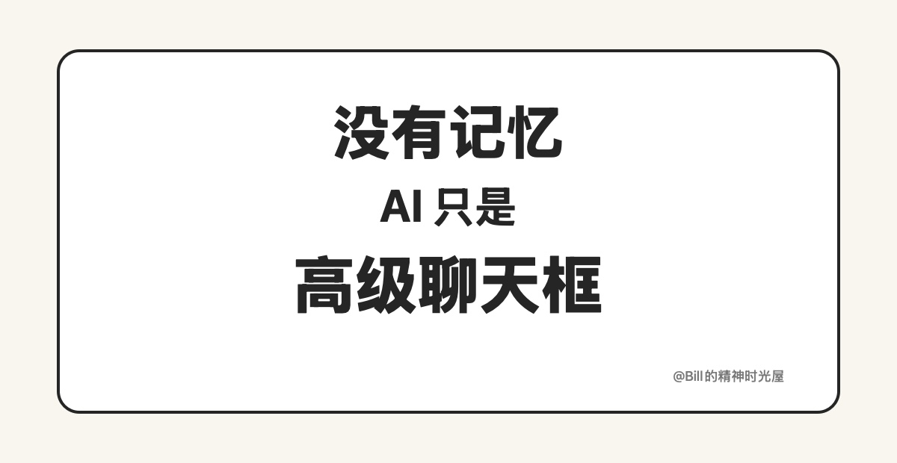
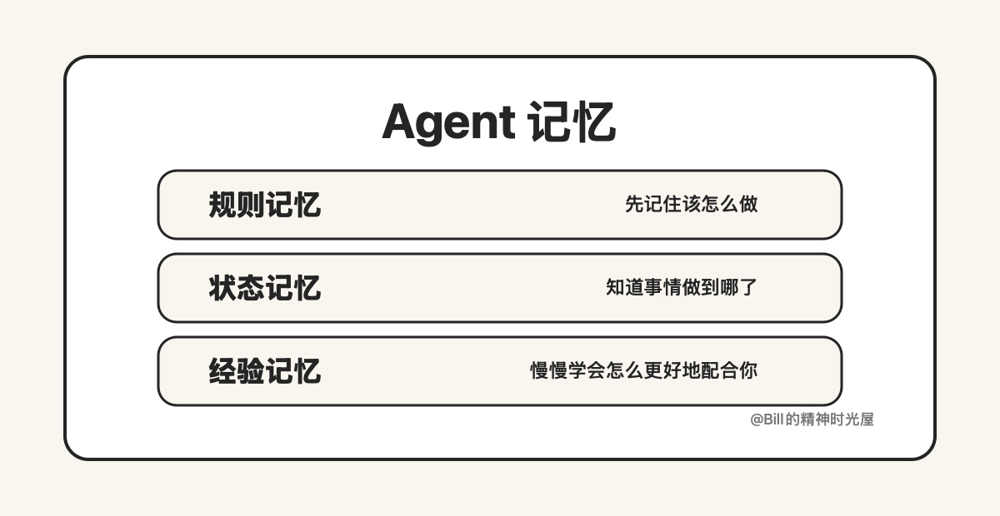

> TL;DR
>
> AI 从“聊天框”走向“长期协作者”的关键一步，不是模型再多会一点，而是终于开始具备了记忆。只是这里的记忆，已经不是单纯保存聊天记录，而是把规则写下来，把状态存下来，把经验沉淀下来。

过去这两年，很多人已经明显感受到，大模型单次回答的能力越来越强了：能写、能改、能总结、能分析，很多时候甚至已经超过了大部分人的预期。但即便如此，大多数 AI 产品给人的主观感受，依然更像一个“高级聊天框”，而不是一个真正能长期配合你的协作者。问题不只是它会不会回答，而是它很难持续承接一件事。换一个对话窗口，很多上下文就断了；聊得再深，过段时间也像重新开始。

真正有意思的是，今天最顶尖的 Agent 产品，已经不再把“记忆”理解成简单保存聊天记录。OpenClaw 会把“这次对话里真正要发给模型的内容”和“可以长期落盘保存的记忆”分开；Claude Code 也不是单纯靠聊天历史延续，而是靠规则文件和自动沉淀下来的经验跨会话接着做；Codex 更进一步，把大量连续性放在项目规则、计划文档和状态文档里，而不是寄希望于一个无限增长的聊天窗口。

结合这些产品的公开实践，我越来越觉得，今天 AI 记忆里真正重要的，主要不是“聊过什么”，而是三类东西：规则、状态、经验。

## 第一层：规则记忆

很多人以为 AI 记忆首先应该记住“我是谁”，但在顶尖 Agent 里，更优先被保存下来的，往往是“这件事该怎么做”。Claude Code 会先读一份规则文件，里面写着项目约定、代码规范和常见工作方式；Codex 也是在任何工作开始前先读项目说明，把目录规则、默认协作方式和注意事项先吃进去。这里的重点不是让 AI 展示聪明，而是先别跑偏。一个真正的协作者，首先要知道边界。

## 第二层：状态记忆

普通聊天框最大的问题，不是知识不够，而是状态不连续。上次做到哪了，已经决定了什么，哪些问题验证过了，下一步该接什么，这些信息很容易在窗口切换和上下文压缩中丢掉。Codex 在长任务里的做法就很典型：不是靠一段越来越长的提示词硬撑，而是把计划、当前进度、已经做过的修改、跑出来的结果、还没解决的问题，持续写回文档和工作区。真正支撑长期协作的，不是 AI 还记得你刚刚说过哪句话，而是它知道这件事现在推进到了哪一步。聊天框只能接一句话，协作者必须能接一件事。

## 第三层：经验记忆

再往前一步，记忆才真正开始体现“长期协作者”的价值。Claude Code 会自动把一些有用的经验沉淀下来，比如常用命令、调试经验，以及它在合作中慢慢发现的偏好和习惯。OpenClaw 也不是把所有记忆都永久塞进当前上下文，而是把长期记忆和每天的记录存到外部，再在需要的时候调回来。这里最重要的变化不是“信息变多了”，而是协作开始出现复利：它慢慢知道什么样的配合方式对你更有效，什么样的结果你会认可，什么样的废话不该再说。真正有价值的 AI 记忆，不是存下更多内容，而是沉淀出更有效的协作经验。

所以我越来越觉得，记忆不是一个锦上添花的小功能，而是产品形态发生变化的分水岭。没有记忆时，AI 只能响应当下的问题；有了规则记忆，它不容易跑偏；有了状态记忆，它可以接着做事；有了经验记忆，它才会越来越像一个真正的搭档。

一句话总结：**没有记忆，AI 只是高级聊天框；有了记忆，AI 才开始真正承接长期工作。**
