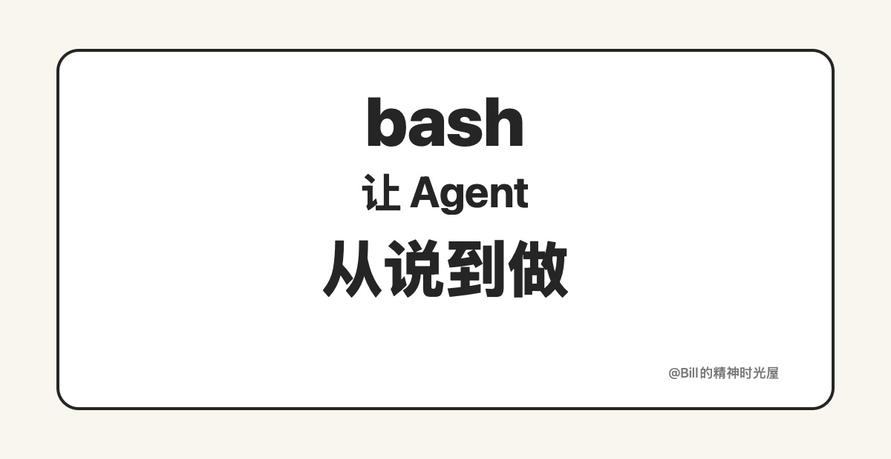
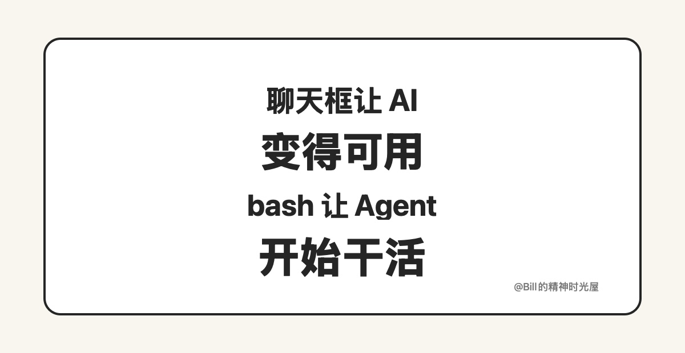

> TL;DR
>
> Agent 时代最重要的变化，不是 AI 说得更好了，而是它终于开始能做了。而在“让 AI 从说到做”这件事上，bash 是一个经常被低估、但非常关键的执行层。

过去大家谈 AI，更多谈的是它会不会回答、会不会总结、会不会写东西。但到了 Agent 时代，一个更关键的问题出来了：它能不能真的把事情做下去。

bash 这个看起来很老的东西，在 Agent 时代反而重新变重要了。不是因为 bash 多高级，而是因为它天然就是“执行层”。聊天框里的 AI 更像顾问，能分析、能建议、能解释；但只靠聊天，很多事情永远停留在“知道怎么做”。bash 的意义在于，它能把“知道怎么做”立刻接到“开始动手做”。

## bash 为什么对 Agent 特别友好

第一，它是文本接口，天然适合 AI 理解和生成。命令、参数、输出，都是结构化的文字。

第二，它是可组合的，一个命令不够，就继续串下一个命令；查文件、跑脚本、搜内容、改结果，可以一步步接起来。

第三，它是可验证的，命令一跑就有反馈，成功还是失败、输出是什么、下一步该怎么修，AI 都能立刻看到。

第四，它是可重复的，今天能跑的命令，明天还能继续跑；一次好用，后面就能沉淀成脚本和工作流。

## 这件事不只和程序员有关

很多人看到 bash，会下意识觉得这是不是程序员的东西。其实不是。对普通人来说，真正重要的不是 bash 这个词，而是 Agent 终于有了一种稳定的执行方式。

比如你想把一个网站跑起来。过去聊天框里的 AI 可以告诉你“应该怎么做”，但真正开始安装依赖、启动本地服务、发现端口冲突、改完再重启，往往还是要你自己一遍遍接手。现在如果 Agent 能调 bash，很多时候你只要说一句“启动并打开网站”，后面这些步骤它就能自己串起来。

再比如你想批量整理一堆文件，聊天框只能告诉你“可以怎么命名、怎么分类”；但 Agent 如果能调 bash，它就可以真的去扫描目录、重命名文件、移动文件、生成结果。

再比如你只是想把一堆录音转文字、把几十张图片压缩改名、把一个 Excel 导成固定格式、把网站内容抓下来整理成文档，这些事情本质上都不是“聊明白”就结束了，而是要真的执行一连串动作。只要 Agent 能稳定调 bash，它就不再只是给你建议，而是能把事情往前推。

## 没有 bash，很多 Agent 其实还停留在“会说”

没有 bash，很多 AI 其实还是停留在“告诉你怎么做”。它可以给方案、写步骤、提建议，但最后还是得你自己去点、去改、去执行。可一旦有了 bash，事情就不一样了。AI 开始能查文件、跑测试、执行脚本、整理结果、继续修正。到了这一步，它才不是一个只会聊天的模型，而是一个真的在推进事情的 Agent。

Agent 时代最重要的变化，不是 AI 说得更好了，而是它终于开始能做了。而 bash，就是把“会说”接到“会做”之间的那层桥。

一句话总结：**聊天框让 AI 变得可用，bash 让 Agent 开始干活。**
