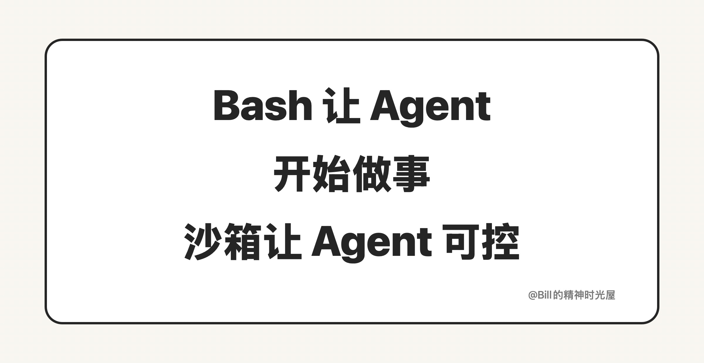

<!-- article_id: art_467e15c8a6e0 -->
> TL;DR
>
> Bash 让 Agent 从“会说”走向“会做”，但光会做还不够。Agent 一旦开始执行，真正重要的就不只是能力，而是边界。没有边界，AI 越能干活，你反而越不敢把事情交给它。

过去很多人用 AI，最大的感受还是“它很会说”。会解释，会总结，会写，会给建议。但 Agent 时代真正大的变化，不在于它说得更好了，而在于它开始能做事了。它可以读文件、改文件、跑命令、启动服务、调用工具，把一个任务往前推进。Bash 这种命令执行方式的价值就在这里：它把 AI 从“知道怎么做”推进到了“开始动手做”。

可事情走到这一步，问题也跟着变了。以前你担心的是 AI 会不会说错，现在你更该担心的是 AI 会不会做错。你本来只想让它改一个目录里的文件，它却把别的目录也改了；你本来只想让它启动一个网站，它却把别的服务也停了；你本来只想让它整理几个文件，它却误删了旧文件；你本来只想让它读本地资料，它却去访问了你根本不想让它碰的资源。AI 一旦开始执行，风险就不再停留在“回答质量”上，而会直接落到真实环境里。

所以，AI 会做还不够，还得限制 AI 做什么。

这时候就需要沙箱，也就是 Sandbox。你可以把它理解成给 AI 画出来的一个安全区。哪些文件能读，哪些文件能改，哪些命令能跑，哪些网络能访问，都先圈清楚，再让它在这个范围里干活。圈里面它可以做事，圈外面的东西它碰不到，或者碰之前必须先经过你确认。它的意义不是把 AI 变弱，而是把 AI 变得可控。

很多人一听“限制”，第一反应会觉得这是不是把 AI 的能力削弱了。其实恰恰相反。没有边界，AI 越能做事，你越不敢放手。因为你永远不知道它会不会多做、误做、乱做。可一旦边界清楚了，很多原本你不敢交给它的事，反而就敢交了。你知道它只能在当前工作区里改文件，只能执行允许的命令，只能访问被允许的资源，出了圈就停下来。到了这个阶段，AI 才开始从一个“危险的执行者”，变成一个“可控的执行者”。

这件事并不只发生在写代码这种场景里。哪怕你只是让 Agent 整理文档、批量改名、转换文件格式、启动一个本地工具、跑一个固定脚本，你也不会希望它误删、误改、误操作别的东西。对普通人来说，沙箱解决的也是一个很朴素的问题：怎么让 AI 真正帮你做事，同时又不把事情做坏。

所以，Bash 和 Sandbox 其实是在解决同一件事的两个阶段。Bash 解决的是让 Agent 从说到做，Sandbox 解决的是让 Agent 从乱做到可控地做。前者让 AI 开始进入执行层，后者让 AI 真正变得可用。没有执行能力，Agent 只是高级聊天框；没有边界，Agent 也只是一个你不敢真正放手使用的执行者。只有这两个东西放在一起，Agent 才开始像一个能长期协作的工具，而不是一个偶尔帮你一下的聊天对象。
