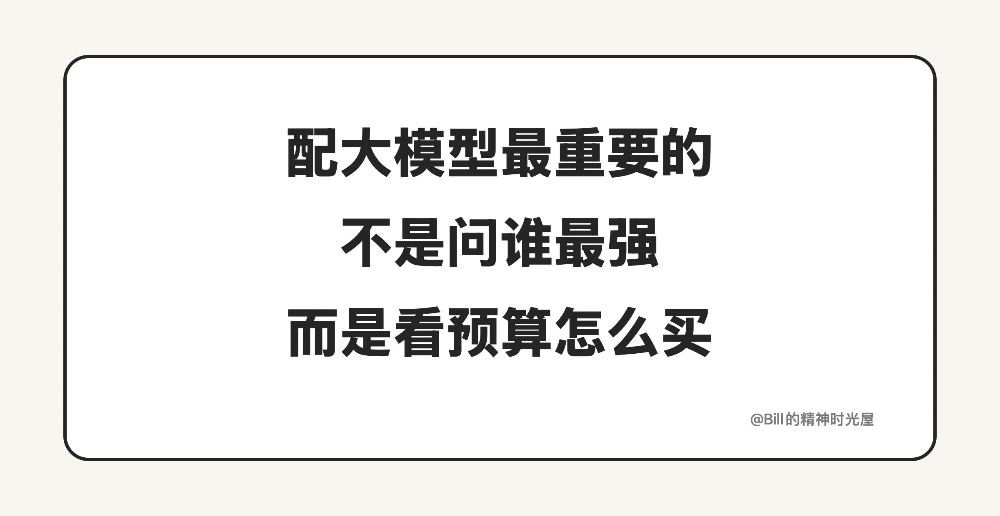
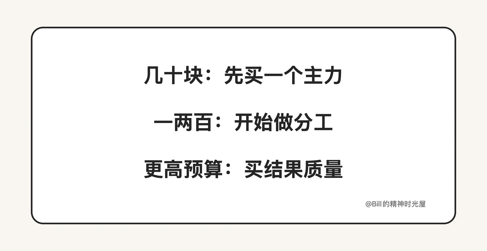

<!-- article_id: art_924798185325 -->
> TL;DR
> 配大模型最重要的，不是研究谁最强，而是看你的预算，适合换来什么能力。
> 预算低，就先买一个稳定主力；预算上来，再开始分工。

很多人一聊大模型，第一反应就是问：现在到底谁最强？

但对大多数人来说，真正重要的不是谁最强，而是如果你每个月只愿意花这么多钱，这笔钱到底该怎么配，才最值。

因为今天很多人用不好 AI，不是模型不够强，而是配置思路错了。**配模型这件事，核心从来不是追最强，而是把有限预算换成最适合自己的能力组合。**

## 几十块钱，先买一个稳定主力

如果预算只是几十块钱，我觉得最重要的不是配齐，而是先有一个稳定主力。

这时候你买的不是顶级能力，而是进入状态的资格。你需要的是一个你愿意天天打开、天天用的模型，把写作、改文案、查资料、理思路这些高频动作先跑顺。

这一档的正确思路，不是“什么都想试一点”，而是**先选一个综合能力稳定、你愿意长期打开的主力模型**。因为对大多数人来说，真正拉开差距的从来不是你注册过多少产品，而是你有没有一个模型已经进入了自己的日常工作。

对大多数人来说，先稳定用起来，比研究参数差异更重要。

## 一两百块钱，开始做分工

如果预算到了一两百块钱，就不该再想着一个模型包打天下了。

因为到了这个阶段，AI 往往已经不只是随手问答，而是开始进入你的真实工作流。你会慢慢发现，有些任务要快，有些任务要深；有些任务可以便宜解决，有些任务能力差一截，结果就会差很多。

所以这一档最值钱的，不是更贵，而是开始有分工。**最常见、也最划算的配法，就是一个日常主力，再加一个专项能力更强的模型。**

比如说，日常写作、查资料、整理思路，你可以长期用一个综合型主力；但如果你已经开始高频写代码、做复杂推理，或者大量处理图片和多模态任务，那第二个模型就应该是来补短板的，而不是简单重复。

## 更高预算，买的是成功率

如果你愿意把预算再往上拉，那买的往往就不只是体验了，而是结果质量。

顶级模型真正值钱的地方，不是回答更漂亮，而是在复杂任务里更不容易跑偏，返工更少，关键时刻更容易给出靠谱结果。

到这一档，你买的已经不是“多一个聊天框”，而是更高的成功率。复杂代码能不能一次跑通，重要文档能不能少返工，关键判断能不能少走弯路，这些地方省下来的，往往不是几块钱，而是你的时间和结果质量。

## 我的结论

如果你只是普通用户，几十块钱就先把一个主力模型用透。  
如果你已经高频在用 AI，一两百块钱最值得拿来做分工。  
如果 AI 已经开始影响你的工作结果，那更高预算买到的，往往不是奢侈，而是效率和质量。

所以配大模型最重要的，不是一直问谁最强，而是想清楚：**你现在这笔钱，到底最该买什么能力。**
