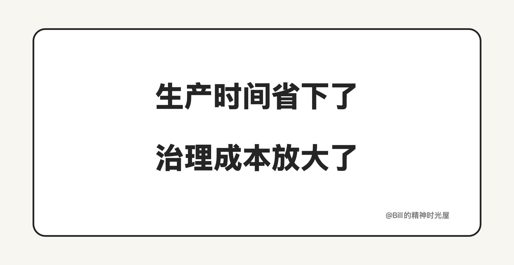

<!-- article_id: art_f07a2d2b6c41 -->
> TL;DR
>
> AI 真正省下来的，往往只是生产时间。第一版出来得越快，后面的测试、返工、验收和兜底，反而越容易一起被放大。所以它降低了生产成本，却放大了治理成本。

原计划要做 5 天的需求，现在让 AI 先上，1 小时就能把第一版跑出来。

刚看到结果的时候，人很容易兴奋。因为这种提速不是快一点，而是夸张地快。

但真正麻烦的，往往从这之后才开始。

你要开始测试，要开始补边界，要开始返工，要开始验收。最后你会发现，前面那 1 小时虽然是真的省下来了，可后面还是要再花 3、4 天，才能把这件事真正弄到能用。

这就是很多人用了 AI 之后，依然没有省下多少时间的原因。

很多人会误以为，既然 AI 已经把“做出来”这件事压得这么快了，那整体时间也应该跟着一起缩短。现实却不是这样。

因为一件事情真正耗时的部分，本来就不只在生产。

AI 最擅长压缩的，其实只是生产时间。它能很快给你第一版，很快给你一个方案，很快把东西先做出来。只要任务足够明确，它在这一段的效率确实很夸张。

但第一版出来，不等于事情结束，很多时候反而意味着真正耗时的部分才刚刚开始。

真正费时间的是后面的那些事：方向对不对，结果能不能上线，边界有没有漏，返工会不会继续扩散，最后出了问题谁来负责。

以前没有 AI 的时候，很多想法会被卡死在执行阶段。因为做一版太贵，试一次太慢，很多需求连启动都难。现在不一样了，第一版太容易出现了，半成品也太容易堆出来了。看起来选择变多了，推进变快了，但同时也意味着你要处理更多判断、更多分支、更多返工风险。

这也是为什么很多人会有一种反直觉的体验：表面上自己更高效了，实际上却更累了。不是因为 AI 没干活，而是因为它省掉的是“亲手做第一版”的时间，新增的却是“管理第一版”的时间。

你要判断这版到底值不值得继续改，要判断哪些问题只是小瑕疵，哪些问题会在后面越滚越大；你要决定什么时候继续让 AI 改，什么时候必须自己接手；你还要承担最后结果能不能上线、出了问题谁来兜底。

所以 AI 带来的变化，不只是效率提升。

更准确地说，它把时间重新分配了：原来最贵的是生产，现在越来越贵的是治理。你省下来的，是动手做第一版的时间；你新增的，是测试、判断、验收和兜底的时间。

第一版出来得越快，治理成本往往越容易被放大。因为生产一旦便宜，系统里就会出现更多看起来差不多能用的东西，也会出现更多需要筛选、测试和收口的地方。

所以以后真正拉开差距的，可能也不是谁更会让 AI 做，而是谁更会管住 AI 做出来的结果。
