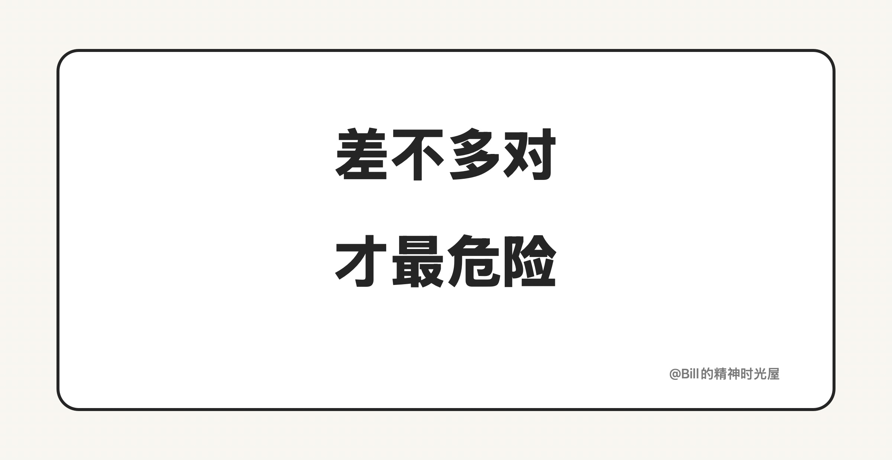

<!-- article_id: art_aa4f08164f3e -->
> TL;DR
>
> AI 最危险的时候，常常是它交出一份看起来已经差不多能用的结果。真正把时间拖掉的，往往是你后面基于这份结果一路补出来的返工。

很多人一提 AI 的风险，先想到的可能是幻觉，可能是离谱的答案，可能是一本正经地给错结论。

这些情况当然麻烦，但它们有一个共同点：很容易被看见。

你一眼觉得不对，手就会停下来。你会重问，会查证，会换个办法，至少不会顺手把它交付出去。

真正麻烦的，往往是另一种结果。

比如让 AI 写一段代码。第一版出来以后，页面能打开，流程能走通，功能也有个七八成。你看一眼，会觉得大方向已经有了，后面只剩一点收尾：补几个状态，改几个边界条件，再顺一顺交互，也许今天就能结束。

于是你继续改，继续补，继续往下接后面的逻辑。

可改到第三轮、第四轮，问题才慢慢冒出来。这个地方状态没收住，那个地方边界条件漏了，几段逻辑开始互相牵扯，前面像是已经做完的部分，后面又得拆开重来。回头再看，真正拖时间的，早就不是 AI 第一版写了什么，而是你后面为了把它修成“真的能用”补进去的那些东西。

这就是“差不多对”最麻烦的地方。

它不会把你当场拦住，反而会给你一种错觉：已经差不多了，先往下走吧。可一旦你接受了这个前提，后面每一步都会默认这份结果大体可靠。你会在它上面继续加逻辑，继续做判断，继续接后续动作。等你终于发现问题的时候，那个偏差往往已经不在第一版里了，早就散进了后面的好几个环节。

代码里会这样，写文章、做总结、整理方案也一样。

AI 给你一版文案，结构看着顺，语气也像那么回事，你会觉得后面只是润色一下。可改着改着才发现，真正关键的那句话没有立住，几个例子也撑不起结论。

AI 给你一版总结，信息看着挺全，你会觉得已经能拿去往下做判断了。可真正用起来才发现，关键前提漏了，重点和次要内容也混在了一起。

很多真正昂贵的问题，都不是从离谱开始的。

它们往往始于一句“应该可以了吧”，始于一次没有继续深究的放行，始于一份看起来已经差不多的结果。

所以 AI 真正进入工作流以后，真正拉开差距的，已经不只是让它把第一版做出来。

更重要的是，你能不能及时看出：这份东西虽然像那么回事，但还没有资格进入下一步。

差不多对，才是 AI 最危险的地方。
