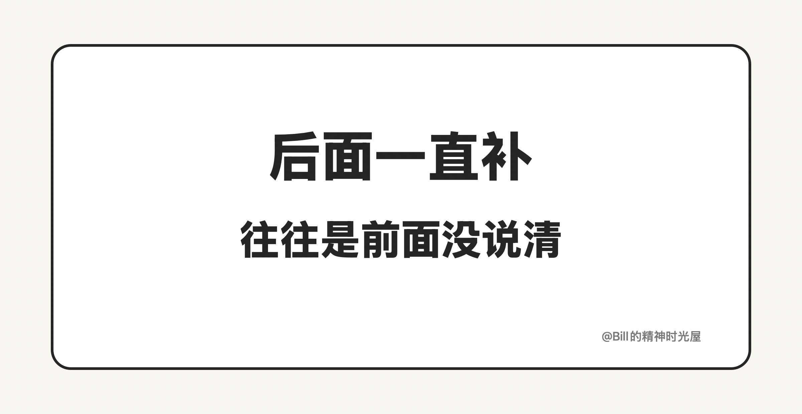

<!-- article_id: art_6f2ab5a91c3d -->
> TL;DR
>
> AI 总停在半成品，很多时候不在于你想不想要成品，而在于“做完”这件事从一开始就没人定义清楚。完成线越模糊，AI 越容易把“像那么回事”当成交付。

很多人其实一开始就想让 AI 直接交成品。可最后拿到手的，还是经常只有一个看起来已经差不多的版本：页面能跑，流程也通，文案读起来挺顺，方案结构也有了。第一眼看过去，你会觉得后面只是补几个细节。可真往下做，状态没收住，边界漏了，重点也偏了，后面的时间全花在兜底和返工上。

问题往往不在你有没有说“我要成品”，而在于你有没有把“成品到底长什么样”提前说清楚。

对 AI 来说，最容易先做出来的，永远是表面完成度。格式是对的，语气是顺的，流程也能走起来，看上去已经很像一份能交的东西。可真实工作里的“做完”，从来不只看这些。页面要不要覆盖空态和报错态，方案有没有回答关键取舍，文章最后那句判断有没有立住，这些才决定它能不能进入下一步。

也就是说，很多半成品的问题，并不是出在它完全不会做，而是出在它先把那些最容易被看见的部分补齐了，把真正决定能不能交付的东西留在了后面。如果这条线没有提前划清，AI 停在半成品几乎是必然的。

人之所以特别容易在这里放行，也是因为表面完成度最会骗人。东西一旦看着像样，脑子里就会自动冒出一句：差不多了，先往下走吧。可工作流里最贵的，恰恰就是这种“先往下走”。因为后面每多接一步，你都等于在替一份还没做完的结果继续下注。

所以要减少半成品，我觉得至少有三件事得提前做。

第一，先定义“做完”，再让 AI 开工。任务名不等于完成标准。“写个页面”“整理个方案”“起草一篇文章”都太粗了。你要直接把完成线写出来：至少覆盖哪些状态，必须回答哪几个问题，哪些坑不能留到下一步，哪一句结论必须落住。完成标准越模糊，AI 越容易把“像那么回事”当成交付。

第二，让 AI 在交付前先跑一轮自查。不要只在它交稿后补一句“你再检查一下”，而是让它按清单回答：有没有漏前提，漏边界，漏约束；哪些地方还只是占位；哪些风险必须人工确认。这样你看到的就不只是结果本身，还能更早看到它自己暴露出来的不确定性。很多本来会混进后面流程的坑，其实在这一轮就能先拦下来。

第三，提前约定什么时候别补了，直接重来。有些稿子、有些代码，第一版的底子就已经歪了。核心方向错了，结构错了，边界漏得太多，同一类问题连改两三轮还在反复，这时候继续补，通常只会把后面的时间一起拖进去。退回去重做一个合格版本，反而更省。

AI 真正进入工作流以后，很多效率差距，最后都会落到一件事上：你有没有把“做到什么算完成”这条线提前划出来。

这条线划得越清楚，AI 停在半成品的概率才会越低。
