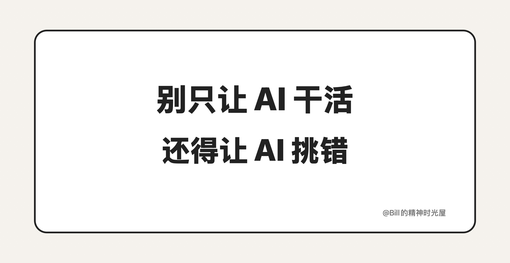

<!-- article_id: art_31e57cf1b842 -->
> TL;DR
>
> 只让一个 AI 从头干到尾，很多问题最后都会被它顺着同一条思路一路带下去。更稳的做法，是直接上两个 Agent：一个负责干活，一个负责挑错。

昨天提到，很多 AI 结果总差一口气。那该怎么解决？我现在比较常用的办法，就是双 Agent。

别只让 AI 干活，还得让 AI 挑错。

相比于以往只有一个 Agent，现在我创造了两个 Agent。一个是只管往前写的 Generator，另一个是只管挑错的 Evaluator。

只用一个 Agent 干活的时候，第一版通常都出得挺快。代码能跑，文章也像那么回事，方案看上去也完整。问题往往不出在第一眼，而是出在后面。你接着改两轮、三轮，才发现前面的根基没打好。有些判断没立住，有些边界没收干净，有些地方表面修过了，实际上只是被一路拖到了后面。

这种时候最麻烦的，不是它不会做，而是它太会顺着自己的思路继续往下补。它写完以后再自查，看起来也在检查，但很多时候还是在用同一套前提继续修。所以一些真正该被拎出来的问题，最后没有被挑出来，只是被往后拖。

既然一个 Agent 又当球员又当裁判，就容易一错再错，那不如干脆把这两个角色彻底分开。

一个是 Generator，职责很简单，就是按要求先把东西做出来。另一个是 Evaluator，职责也很简单，就是专门挑错。它不负责往下写，也不负责帮忙圆，它只看一件事：这版东西到底还有什么问题，能不能继续往下走。

这样一拆，很多事一下子就顺了。

Generator 就负责先把东西做出来，不用一边写一边猜“这样到底算不算完”。要求你可以直接压给它，让它先按这个标准往前做。Evaluator 则不用背着“这是我自己刚写的”那种惯性继续圆。它更容易直接看到：这里前提漏了，那里边界没收住，这一段看着顺，其实关键那句话根本没打稳。

还有一个很现实的好处，就是该停的时候更容易停。Generator 天然会想继续改，继续修，继续把这一版往前推。可很多时间真正浪费掉，不是因为多改了一轮，而是因为一个底子已经歪掉的版本，被硬生生补了五六轮。Evaluator 更容易直接说：这版别补了，重来更快。

实际跑起来也不复杂。Generator 先交一版，Evaluator 不接着写，只在旁边挑问题：这里前提漏了，那里边界没收住，这段判断还不够硬。然后 Generator 照着这 1、2、3 条去改，再交回来。如果 Evaluator 还觉得有问题，就继续挑；挑不出新的问题了，这版东西再继续往下走。

这套方法对写代码很好用，对写文章、做总结也一样。写代码时，Generator 先把功能搭起来，Evaluator 专门盯状态、边界和风险。写文章时，Generator 先把整篇写出来，Evaluator 专门盯真正那句要说的话有没有立住。做总结时，Evaluator 也更容易把漏掉的前提和轻重不分的地方翻出来。

所以现在，我不会再让 AI 只负责干活了。我更想在流程里，固定放一个专门挑错的角色。很多结果最后更稳，不是因为第一版更强，而是因为中间一直有人盯着：这东西到底能不能继续往下走。
