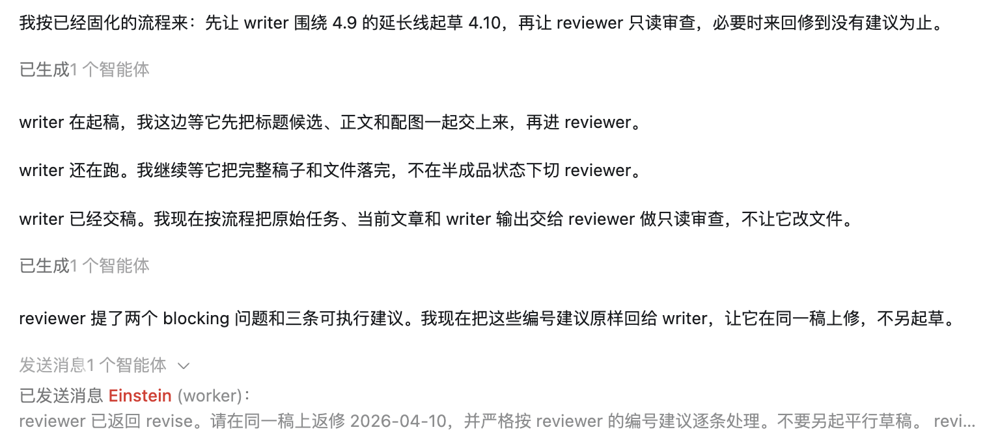
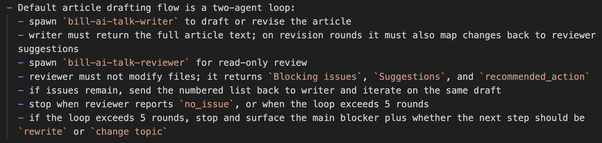

<!-- article_id: art_d0c1a8b4e291 -->
> TL;DR
>
> 先建 writer 和 reviewer 的配置文件，再把各自职责、来回修改的规则和停止条件写进 AGENTS.md，这套双 Agent 流程就能在项目里稳定跑起来。

昨天我提到，一个 Agent 既写又审，最大的问题不是写不出来，而是太容易自我放过。

那今天就谈谈如何使用 Codex 来实现双 Agent 架构。

**第一步：先拆角色**

我先做的，不是改 prompt，而是先把角色拆开。

在 agent 项目中，我直接定义了两个 Agent：bill-ai-talk-writer 和 bill-ai-talk-reviewer。

Writer 只管写和改。它负责根据题目先把文章做出来，必要时继续改正文、标题、配图、TL;DR。  
Reviewer 只管读和提建议。它不许改文件，只负责看这版到底哪里还不行，然后把修改建议列出来。

这一步很关键。因为从这里开始，生成和判断就不再混在一起了。

**第二步：把职责写进配置文件**

角色拆完以后，我在项目下面建了两个配置文件，当然都是 AI 帮我建的：

- `.codex/agents/bill-ai-talk-writer.toml`
- `.codex/agents/bill-ai-talk-reviewer.toml`

Writer 那个文件里，我主要写的是：它的目标是什么，文章默认该写到什么长度，标题不能只是准确、还得有吸引力，正文不能一股 AI 味，配图要怎么配，最后输出要带哪些东西。

Reviewer 那个文件里，我限制得更死：它只读，不改。它要重点看标题够不够强、正文有没有重复句式、有没有写作分析腔、配图值不值、TL;DR 是不是只在概括今天这篇。最重要的是，它不能只说“这里不太好”，而是必须把建议按 1、2、3 列出来。

**第三步：把协作规则写死**

光有两个角色还不够。如果不把流程写死，最后还是会变成一团乱。

所以我后来把这些规则直接写进了 AGENTS.md。里面最重要的几条就是：

- 先跑 Writer
- Writer 必须把整篇文章交出来
- 再跑 Reviewer
- Reviewer 只能读，不能改
- 它给的建议必须按 1、2、3 列出来
- Writer 回来改的时候，也必须逐条回应
- 如果来回超过 5 轮，还没收住，就别再硬补了，直接停下来，告诉我卡在哪

这一步做完以后，后面很多事就不再靠感觉了。因为规则已经先写死在项目里，不用每次重新口头交代。

到了真正跑起来的时候，大概就是下面这个样子：

**第四步：按 AGENTS.md 的流程真正跑起来**

到了真正写文章的时候，agent 就会按照 AGENTS.md 里写的步骤运行。第三步已经把双 Agent 的具体配合讲清楚了，所以这里我直接给你看我在 AGENTS.md 里是怎么写的：

双 Agent 这件事最重要的，不是同时开两个模型，也不是名字起得多漂亮。

我自己最后踩下来的经验其实很简单：别只想着“多开一个 Agent 试试”，而是要把谁来写、谁来审、审完怎么回、什么时候该停，全都提前写清楚。只有这样，Writer 和 Reviewer 才不只是两个概念，而是真的能在这个项目里长期跑起来的两个角色。
