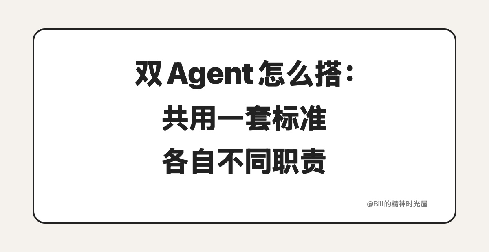

<!-- article_id: art_7d84f6c2e913 -->
> TL;DR
>
> Executor 和 Reviewer 要想长期稳定运行，光把两个角色分开还不够。更重要的是先把标准明确下来，再把各自的职责写清楚，最后把这一次任务需要的背景单独给到位。这样一个负责干活，一个负责评审，才不会各干各的。

前两天提到，双 Agent 真正要跑稳，关键不只是多放一个角色进流程里。接下来更重要的问题是：Executor 和 Reviewer 到底该怎么设计，才不会越跑越乱。

我以前踩过一个很典型的坑。角色是拆开了，流程看起来也有了，可跑几轮以后还是不稳。Executor 按自己的理解往前干活，Reviewer 再按另一套理解回来挑错。今天觉得标题这样可以，明天又说太平淡；这一轮盯结构，下一轮又只盯字数；Executor 觉得自己已经按要求写完了，Reviewer 却说根本没到能继续往下走的程度。表面上看，是两个人在协作，实际上是两套标准在打架。

所以我后来越来越确定一件事：Executor 和 Reviewer 这种架构，最重要的不是先拆角色，而是先把它们共用的那套标准明确下来。共享的是标准，分开的是职责和视角。这个顺序一旦反了，后面就很容易一边生成、一边返工、一边互相消耗。

我自己现在比较稳定的做法，是把这套东西拆成三层。

## 第一层：先把标准明确下来

第一层，是**共享规则**。这一层一定要放在最上面，而且两个角色都看同一份。比如这篇文章到底服务什么主题，标题什么样才算过关，TL;DR 应该怎么写，正文有哪些明确禁区，文中配图什么时候该上、什么时候不该硬凑，这些都不能一人一套。

因为只要这一层没共享，后面一定会乱。Executor 会按一把尺子往前干活，Reviewer 会按另一把尺子回头挑错。最后你看到的就不是正常 review，而是**标准错乱**。今天改的是标题，明天改的是立意，后天改的又变成口气。稿子当然会越来越乱，人也会越来越烦。

所以共享规则这层的作用，不是写得多全，而是先把那把共同的尺子说明白。后面不管是 Executor 在做，还是 Reviewer 在审，至少大家有同一套评价标准。

## 第二层：把岗位职责拆开

第二层，是**角色专属指令**。共享规则明确下来以后，第二层就必须拆开写，而且要写得很清楚。

**Executor** 关心的，是怎么把东西先做出来。它需要知道这篇该怎么起手，核心判断怎么立，例子放哪里，段落怎么往前推，什么时候该配图，什么时候该停下来别再加废话。它的任务很明确，就是把一版能进 review 的东西先做出来。

**Reviewer** 则完全是另一套职责。它不该帮忙往下写，也不该忍不住替 Executor 圆场。它只需要盯几件事：标题是不是写满了，正文是不是开始重复，哪一段还有 AI 味，哪一句虽然通顺但不像人话，配图是不是和正文根本不是一回事。它存在的意义，就是把那些 Executor 很容易顺手放过去的问题，单独拎出来。

这一层如果没拆清，第二视角就会慢慢消失。最常见的情况就是 Executor 一边生成一边自查，看起来也在检查，其实还在顺着同一套思路继续修。另一种情况是 Reviewer 忍不住下场一起写，最后实际的审稿人又变成了作者。角色边界一旦变模糊，整个架构表面上还是双 Agent，实际上已经退回单 Agent 了。

## 第三层：把这一次任务的背景单独给

第三层，是**运行时材料**。前两层定好以后，第三层就不能再写死在长期规则里了。因为这层管的是这一次任务到底要写什么。

今天写什么主题，这篇和昨天是什么关系，这次是轻接还是重讲，哪些背景不要再复述，核心判断是哪一句，哪些表达必须避开，这些都属于运行时材料。它们不是长期不变的东西，但每一篇都会真的影响结果。

这一层如果放错位置，也会出问题。最典型的就是把所有东西都塞进长期规则里。时间一长，规则越来越冗长，真正对今天这篇最重要的那一点反而被埋没掉了。Executor 看了一大堆要求，最后不知道这篇到底该往哪里写；Reviewer 也会开始抓不到重点，什么都想审，最后反而审不准。

所以运行时材料一定要单独给。这样 Executor 知道这次具体要写什么，Reviewer 也知道这次该按什么任务来审。它们共享的是同一批当次材料，但不会把这些一次性的东西混进长期规则里。

## 为什么这三层不能混

最上面那层，解决的是“大家到底按什么标准做事”；中间那层，解决的是“两个角色各自该干什么”；最下面那层，解决的是“这一次具体要写什么”。三层一旦混掉，系统就会重新变乱。你会感觉流程已经有了，角色也有了，可稿子还是忽好忽坏，review 还是飘来飘去。

所以我现在看 Executor 和 Reviewer，最重要的一点其实很简单：它们当然要分工，但不能各自带一套标准。看到的材料可以一样，干的活也应该不一样，但最后判断好坏的那把尺子，必须是同一把。这样 Reviewer 才不是在拿另一套标准回头挑刺，Executor 也不是在按一套只属于自己的理解往前冲。

这套架构真正稳下来，靠的不是多一个角色，而是先把该共享的东西共享好，再把该分开的东西分开。
