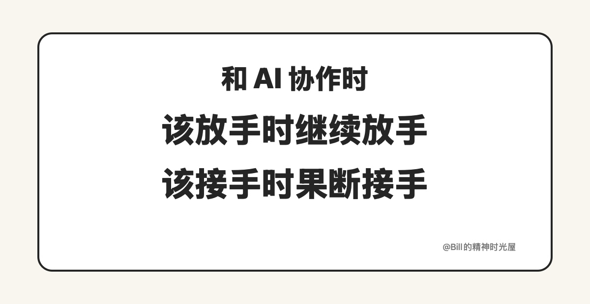

<!-- article_id: art_54b3e1a7c2f9 -->
> TL;DR
>
> 很多人虽然已经开始用 AI 干活了，但效率还是提不上去。问题往往不在 AI 本身，而在于不知道什么时候该继续放手，什么时候必须自己接手。方向已经清楚、标准已经明确、出错也容易回滚的事，就该让 AI 继续干；方向没定、代价很高、涉及取舍和责任的地方，人必须自己站出来。

很多人虽然已经开始用 AI 干活了，但效率还是提不上去。问题不在会不会用，而在接手时机。

有的人一看到 AI 出一点小问题，就马上把活抢回来。结果 AI 永远只能帮他干到七八成，后面还是自己一点点补。也有人一路放着不管，觉得既然都让 AI 做了，那就让它做到底。最后方向偏了，边界漏了，返工比自己一开始做还耗时间。

AI 现在已经开始接更完整的任务了。也正因为这样，真正拉开差距的，不再只是“会不会用”，而是你能不能判断：什么时候继续放手，什么时候必须自己接手。

## 什么情况下，应该让 AI 继续干

有一类事，其实越早接手越浪费。

就是那种方向已经很清楚，评价标准也很清楚，出错以后还能比较容易回滚的事。比如你已经知道页面要做成什么样，状态有哪些，接口怎么接，剩下主要是把这些东西一层层补齐；又比如一篇文章的中心判断已经定了，结构也定了，接下来更多是在补例子、顺句子、收细节。

这类事情的共同点是：**大的方向已经很清楚了。**

这时候最怕的，不是 AI 做错一点，而是你太早接手。因为你一接手，原本还能继续往下推进的那段活，又重新变回了纯人工。很多人嘴上说 AI 不够深，其实不是 AI 干不深，而是自己根本没给它往深处干的机会。

所以只要方向已经定了，标准也说清楚了，剩下更多是执行、补齐、展开、迭代，这些事就该继续让 AI 干。你真正该做的，不是每一步都接过来，而是在中间盯住：它有没有明显跑偏，有没有开始碰到你不想让它碰的地方。

## 什么情况下，必须人自己接手

也有一类事，表面上也能交给 AI，实际上最好别偷这个懒。

就是那些方向本身还没定、标准本身就模糊、结果一旦错了代价会很高的事。

比如这篇文章到底想讲什么，核心判断到底落在哪一句；比如一个产品方案最后到底取哪个方向；比如某个需求虽然能先做出第一版，但它到底值不值得继续投时间；再比如一件事出了问题以后，最后谁来承担责任。这些地方看起来不像“执行”，但恰恰最不能完全交出去。

因为这里真正值钱的，不是把东西先做出来，而是做取舍、定边界、担责任。

AI 当然可以给建议，可以给你几个版本，可以帮你把不同方向先摊开，可最后那一下判断，最好还是人自己来。你一旦把这种地方也一路交出去，最后很容易得到一个看起来很完整、但根本不是你真想要的结果。

## 真正难的，从来不是“会不会用 AI”

很多人现在已经不是不会提问，也不是不会让 AI 干活。

真正把人拉开差距的，往往是另外一种能力：你能不能分清，眼前这件事到底还属于“让 AI 继续往前做”的阶段，还是已经到了“人必须站出来接手”的位置。

接手太早，AI 永远干不深；接手太晚，前面的错误只会越积越多。

所以真正会用 AI 的人，强的不只是 prompt，也不只是工具熟练度，而是这种判断：什么时候继续放手，什么时候果断接手。

这不是操作习惯。

这是 AI 真正进入工作流以后，你必须补上的工作判断。
