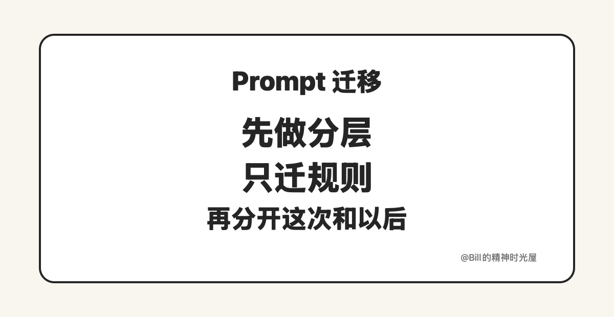

<!-- article_id: art_5e2f9c1d8a47 -->
> TL;DR
>
> 很多人懂了要写 AGENTS.md，真正卡住的不是要不要写，而是接下来怎么迁。更稳的做法不是把整段 Prompt 搬过去，而是先做规则分层：先拆 Prompt，只迁长期规则，再把“这次”留给 Prompt，把“以后”交给 AGENTS.md。

上一篇讲的是，为什么 Prompt 最后都应该变成 AGENTS.md。那这篇就讲讲：道理懂了，接下来到底怎么迁？

很多人第一反应都是，既然 AGENTS.md 更适合长期维护，那就把原来的 Prompt 搬过去。这一步看起来最省事，实际上最容易出问题。因为一段已经写得很长的 Prompt 里，本来就混着好几种不同的东西。你要是不先拆，搬过去的只会是一坨新的东西，而不是一个能长期维护下去的体系。

## 第一步，先别急着写 AGENTS.md，先拆 Prompt

这是最重要的一步。先别急着迁，先把那段 Prompt 拆开。因为一坨 Prompt 里，通常至少混着四类信息：这次任务要做什么，以后一直都适用的规则，某个角色才需要知道的要求，以及某次临时补进去的偏好。

拿我写文章的 Agent 来举例，这次文章写什么、材料是什么、重点想强调什么，显然属于“这次”；标题原则、语言边界、TL;DR 怎么写，这些才属于“以后”；Writer 负责怎么产出，Reviewer 负责怎么验收，又是另一层东西。它们本来就不是一类信息，只是过去被硬塞进了同一段 Prompt。

真正的迁移，不是把这些东西原样搬进 AGENTS.md，而是先把它们拆开。因为能迁进 AGENTS.md 的，从来都不是“这段 Prompt”，而是 Prompt 里那些本来就该长期留下来的东西。

说得更直白一点，Prompt 迁不进 AGENTS.md，真正能迁进去的，只有规则。

## 第二步，先迁长期规则，不要一上来就迁整个系统

拆完之后，下一步也不是把所有东西一次性搬完。

更稳的做法，是先迁最稳定、最确定、以后还会反复用到的那部分。比如写作底线、语言风格、标题原则、完成标准，这些东西最适合先进 AGENTS.md。因为它们本来就不属于某一篇文章，而属于这个 Agent 以后都要反复遵守的规则。

反过来说，那些只属于这一次的东西，就不适合先迁。比如这篇文章的具体背景、这次临时加进来的素材、还没想清楚的个人偏好、某一轮特有的额外要求，这些都不该急着写进 AGENTS.md。它们本来就不是长期规则，硬塞进去，只会让新的体系刚搭起来就开始变乱。

所以迁移时最重要的判断，不是“哪些东西都很重要”，而是“哪些东西以后还会一直用到”。先迁标准，不要先迁细节。这一步做对了，后面 AGENTS.md 才会越来越清楚；这一步做错了，新的体系很快又会变回一坨 Prompt。

## 第三步，把“这次怎么做”和“以后都怎么做”彻底分开

真正迁完之后，并不是 Prompt 消失了，而是 Prompt 的职责终于变清楚了。

以后 Prompt 只负责这次。比如这次写什么，这次材料是什么，这次特别想强调什么，甚至这次想试什么新写法，这些都还应该继续放在 Prompt 里。因为它们本来就是一次性的任务输入。

AGENTS.md 则开始负责以后。比如以后都按什么标准写，什么不能做，什么算完成，Writer 和 Reviewer 各自负责什么，这些都应该沉淀进 AGENTS.md。因为它们本来就是长期规则，不该每次都重新说一遍。这样做完以后，你再开工，先读到的就不再是一段临时拼起来的长 Prompt，而是一套已经放在项目里的长期规则。

这时候你会发现，迁移完成后最明显的变化，不是 Prompt 变短了，而是边界终于清楚了。Prompt 终于只负责“这次”，AGENTS.md 则开始负责“以后”。

很多人以为，从 Prompt 到 AGENTS.md，只是把一段提示词换个地方存起来。其实真正变的，是边界终于分清了：什么属于这次，什么属于以后。Prompt 还是要写，只是它终于不用再背着那些本来就该长期留下来的东西了。
