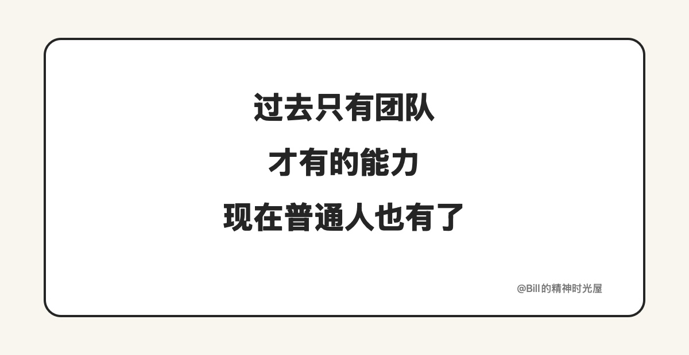

<!-- article_id: art_2bafd5f598a6 -->
> TL;DR
>
> 以前“组织别人干活”对普通人来说门槛很高，因为你没有团队、预算和稳定可调用的人。AI 时代开始不一样了。普通人第一次可以调动 Agent、脚本、规则和文件系统，让一件事围着同一个结果往前走。接下来真正值得升级的，不只是执行力，而是组织能力。

过去普通人最常见的工作方式，就是自己做。

自己查资料，自己写初稿，自己改细节，自己收尾。就算中间会用上一些工具，本质上也只是给某几个步骤提速，最后这件事还是得靠自己亲手做完。很多知识工作者过去不是不想把事情组织起来，而是根本没有这个条件。没有团队，没有预算，也没有一组稳定可调用的人，最后只能自己一把抓。

AI 时代开始出现一个很不一样的变化。普通人第一次不只是能自己干活，还开始有机会组织一组能力，把一件事往前推。

这里说的“组织能力”，不是开会、汇报、带团队，也不是学几句管理学黑话。它更接近另一件事：你能不能先把目标说清楚，再把角色和顺序安排好，把标准和反馈也留在系统里，让外部能力最后都朝着同一个结果去做。以前这件事对一个普通人很难，因为你手里没有那么多可调动的执行单元。现在不一样了，Agent、脚本、规则、文件系统，开始一个个变成你可以调用的能力单元。

拿写一篇文章来说，以前你大概率只能自己从头做到尾。选题自己想，资料自己找，结构自己搭，初稿自己写，改稿自己来，配图自己补。现在你已经可以把其中很大一段组织起来了。一个 Agent 去起草，一个 Agent 去评审，一套规则去限制风格和边界，一组文件把状态、反馈和包装留住。你不再需要自己把每一步都亲手做完，而是开始把起草、评审、留痕这些活安排起来，让它们一起往同一个结果上靠。

这里最值得注意的一点是，工具帮忙和组织能力不是一回事。让 AI 帮你改一句话、补一段材料，这还只是局部提速。只有当你开始安排谁先做、谁后做，什么东西留下来，什么地方要回看，什么结果才能继续往下走，这时候你才是真的在组织一件事被做成。

这件事以前为什么不属于普通人，说到底还是组织成本太高。你想调动别人干活，就得付出沟通成本、协调成本、管理成本，还得承担结果不稳定的风险。所以大多数普通知识工作者最现实的选择，永远是自己做。可 AI 把这件事第一次改了。它真正压低的，不只是某个步骤的执行成本，而是“组织一组能力来做事”的门槛。

这也是为什么我会觉得，AI 时代一个很大的变化，不是普通人终于可以少做一点，而是普通人第一次开始有机会拥有“组织能力”。你可以不靠团队，也不靠外包，先调动一组外部能力把事情跑起来。你要做的，不再只是亲自把每一步都做完，而是把方向说清楚，把角色分开，把标准定住，再让系统持续往前走。

这也意味着，很多知识工作者接下来要学的，不再只是把活亲手做完。以后真正值钱的，当然还包括执行，但不再只是执行。更值钱的是，你能不能把事情组织起来，能不能让不同能力围着一个结果运转，能不能把一次性的帮忙变成一套能重复调用的做事方式。

普通人接下来最值得升级的，也许不是把自己练成一个更能扛的人，而是第一次认真开始练习：怎么组织事情被做成。
