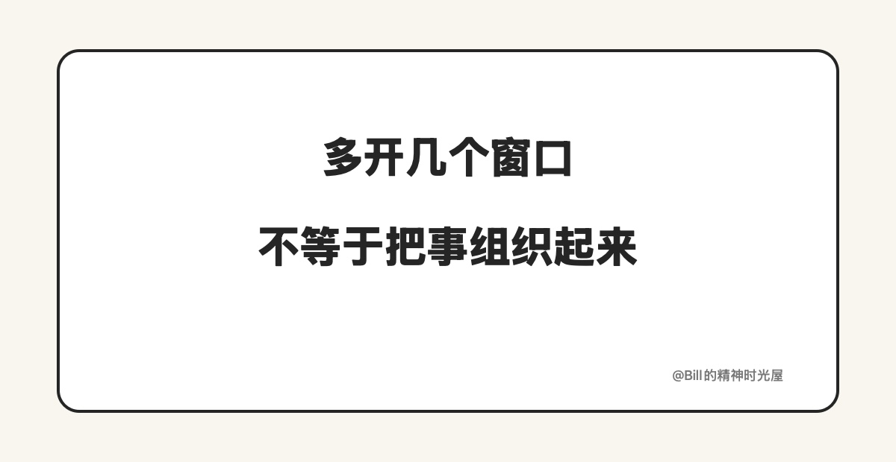

<!-- article_id: art_3f4c2e71b9aa -->
> TL;DR
>
> 很多人现在已经不只开一个对话框了，而是同时开好几个 Agent，让它们写、改、审、查。可多开几个窗口，不等于真的在组织。真正的第一步，不是把活拆得更碎，也不是把窗口开得更多，而是先把角色拆清楚：谁负责往前做，谁负责回头检查，谁负责定标准，谁负责关键地方拍板。

很多人现在已经不满足于只开一个对话框了。

开始同时开多个 Agent，让它们写、改、审、查。表面上看，这已经很像在安排一组外部能力替自己干活了。可很多时候，实际情况只是窗口变多了，人并没有轻下来。因为多开几个窗口，不等于真的在组织。

真正的问题通常不难看。谁负责起草，不清楚。谁负责检查，不清楚。改到什么程度算完，不清楚。每一步之间的衔接，还得靠人自己在中间翻译、搬运、把没说清的话再补一遍。这样一来，这些 Agent 只是同时存在，并没有真正形成分工。看起来像系统，实际上还是你自己带着几个窗口亲自干活。

拿写一篇文章来说，这种情况很常见。你先开一个 Agent 写初稿，写完以后又让它自己检查一遍，觉得不放心，再开另一个窗口让它补几个角度。改到一半，又把前面的要求重新贴一次，最后还是自己亲自决定哪些能留，哪些要删。这样当然也算用了好几个 Agent，但它更像一堆零散帮手，不像一套真正的组织。

组织能力的第一步，为什么是拆角色，说到底是因为角色一旦混在一起，流程里就会冒出很多本来不该有的摩擦。一个 Agent 一边往前做，一边替自己检查，很容易顺着自己的思路一路补下去。人看起来像是在调度，实际上却重新变成了总中转站，前面交一句，后面接一句，哪里不顺就自己补一下。最后最忙的还是人自己。

所以真正要先回答清楚的，不是“我要开几个 Agent”，而是“谁负责什么”。谁负责先把东西往前做出来，谁负责回头检查问题，谁负责把过线标准说明白，谁在关键地方拍板。这几层一旦分开，每个角色的任务会单纯很多，重复解释会少很多，人也不用一直在中间接力。

角色拆开以后，最直接的变化不是看起来更高级，而是事情终于开始顺了。起草的人就只管起草，检查的人就只管检查，标准提前定清楚，问题也更容易在前面被拦下来。这样你就不用每一步都亲自接回来，也不用把同样的话反复讲给不同的窗口听。

如果现在还是这样，一会儿让它写，一会儿又让它自己审，一会儿又重新自己接回来；同样的要求反复交代；谁负责哪一步经常变化；最后所有问题还是自己兜底，那说明你不是在组织 Agent，你只是多开了几个窗口。

普通人开始拥有组织能力以后，最先要学会的，不是把 Agent 开得更多，而是先把角色拆清楚。角色不拆清，窗口再多，最后也只会重新变成自己的负担。
