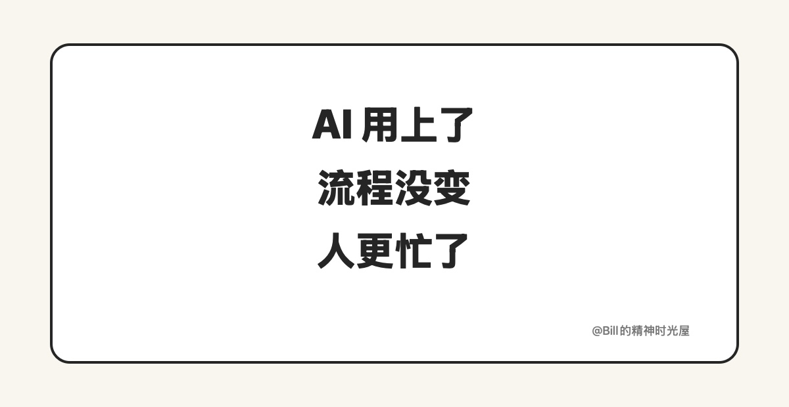
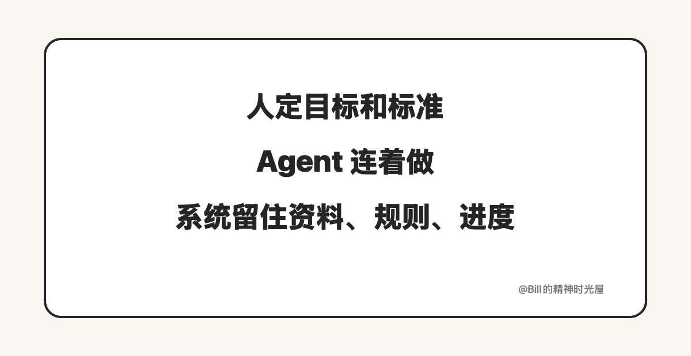

<!-- article_id: art_f1974a4ef2b3 -->
> TL;DR
>
> 很多人已经把 AI 用进了方案、汇报、调研和纪要里，但工作方式其实没变。因为真正没变的，是人还在亲自拆步骤、亲自补背景、亲自把上一段结果送到下一段。真把这套活交出去以后，人主要负责目标和标准，Agent 去连续执行，系统再把资料、规则和进度留住。

开很多 AI 窗口，不等于工作方式已经换了。

不少人现在的日常是这样的：写方案先让 AI 查资料，做汇报让 AI 起提纲，开完会再让 AI 整理纪要，发出去之前再让 AI 润色一遍。看起来每一步都有 AI，结果却是窗口更多了，来回确认更多了，真正一直没停的人还是自己。

问题往往不在 AI 不够强，而在你还是用老办法带着 AI 干活。以前是自己从头做到尾，现在变成自己把每一步拆开，再把 AI 插进几个局部。真正负责解释背景、补缺信息、检查前后、把结果往下传的人，还是你。

## 为什么用了 AI，人还是轻松不下来

拿很多知识工作者都熟悉的场景来说：周会前整理一份汇报。

你先去聊天记录、飞书文档、表格和上周纪要里找材料；然后告诉 AI，这周重点是什么、哪些话能说、哪些风险要留；AI 给出一版提纲后，你再手动补事实、改口径、填数据；接着把内容搬进 PPT 或汇报文档；中途发现有一页前后对不上，又得回头重问一次。最后临发前，你还要自己过一遍，确认老板真正关心的那几个点有没有漏。

这一整套里，AI 当然帮了忙，但它帮的是局部动作。真正把流程串起来的人，还是你。你还是那个要亲自开头、亲自衔接、亲自收尾的人，所以工作并不会因为多了 AI 就突然轻下来。AI 最容易把人骗到的一点，就是让你以为自己已经升级了，实际上只是把原来一个人亲力亲为，变成了带着 AI 一起亲力亲为。

## 真把这套活交出去，不是多一个帮手

还是拿周会汇报的例子来看，真把这套活交出去以后，人先做的事会少很多。

你先把两件事说清楚就够了：这份汇报最后是给谁看的，要帮助对方做什么判断；什么样的内容才算合格，哪些数据、风险和口径不能错。

这两件事清楚了，后面的活就可以让 Agent 连着往下做。它去收集材料，整理本周进展，生成提纲和初稿，把数据回填到固定模板里，再把缺口和不确定项单独标出来。你不用每走一步都重新解释一次，只需要在关键节点看方向有没有偏，判断有没有失真。

但只靠一个 Agent 还不够。如果资料放哪、模板怎么用、上次改到哪、哪些表述不能碰，都还只在你脑子里，那下周你还是得从头再讲一遍。系统得把这些资料、规则和进度留住，Agent 才不是每次都像新来的临时工。

很多人现在不是在用 AI 改变工作方式，而是在用老办法带着 AI 一起加班。

真正的分水岭，不是你今天开了多少个窗口，而是你有没有退出那个“每一步都要亲自接一下”的角色。人负责目标和标准，Agent 负责连续执行，系统负责把资料、规则和进度留住。到这一步，工作方式才算真的变了。
