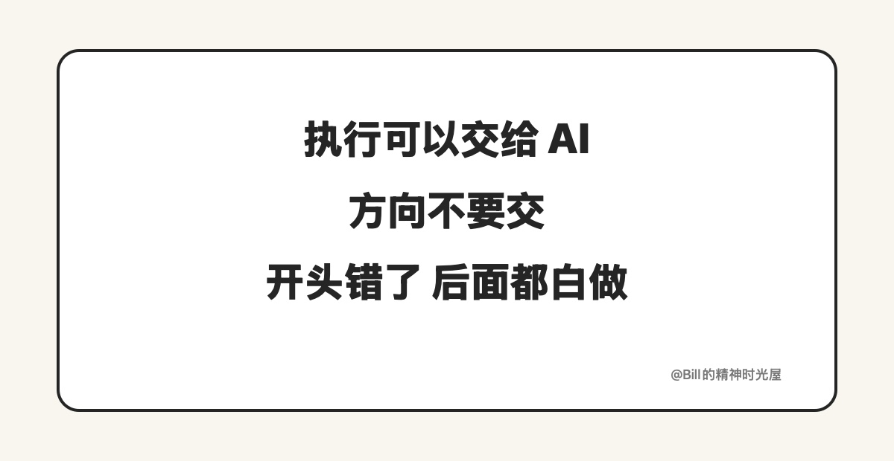
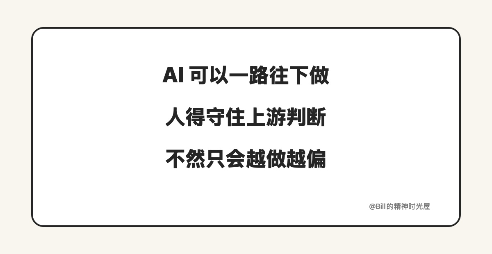

<!-- article_id: art_6d3b9a1c4e72 -->
> TL;DR
>
> 当 AI 真开始在工作里连续往下做，人最该留在自己手里的，不是所有执行，而是三个判断：往哪去，做到什么程度才算过线，偏了以后什么时候拉回来。因为方向错了、标准空了、纠偏缺了，AI 不会让问题变小，只会把问题更快放大。

昨天那篇说的是，很多人其实还没有把活真正交出去，所以自己越用越累。真往前再走一步，把一整段工作让 AI 去跑，最容易误会的一件事是：既然执行能交，判断是不是也能一起交掉。

最好不要。

拿一个很多人都熟悉的场景说。你准备让 AI 拉一版下个月的增长方案，让它去看历史数据、竞品动作、用户反馈，再整理成排期和动作清单。看起来它已经在替你做事了，但有三样东西，一旦你也顺手交出去，后面就很容易一路做偏。

## 方向要你来定

同样叫增长，背后可能根本不是同一件事。

有的时候现在最想要的是新用户，有的时候是先把老客户留住，有的时候是把利润和现金流守住。AI 很会给你一份看起来完整、逻辑也顺的方案，但它不知道这次到底哪一个目标排第一。你不把方向说清楚，它就会按“更像一份好方案”的方式往下补，然后很努力地替你做错事。

所以人最该留下来的第一个能力，不是亲自把方案每一页都写完，而是把这次到底要赢什么讲明白。方向一旦定错，后面执行得越顺，返工就越大。

这也是为什么偏偏是这三件。它们不是随手挑出来的“人类优势”，而是所有后续执行前面的上游判断，决定 AI 到底是在放大正确，还是在放大错误。

## 做到什么程度才算过线，也要你来定

很多人把任务交给 AI，给的是题目，不是交付标准。

“写一份方案”“做一个复盘”“整理一版用户研究”，这些话 AI 都能接，但它最容易先满足的，往往是形式完整、语气像样、结构看起来专业。可真正决定这份东西能不能拿去用的，通常不是这些表面东西，而是有没有关键事实、有没有明确取舍、有没有下一步动作、有没有把不能碰的边界写清楚。

这就是为什么过线标准一定要人来定。不是因为 AI 完全不会检查自己，而是它只能沿着你给出的标准去检查。你连“什么叫过线”都没说清楚，它最后多半只会交一份像样的东西，不一定是一份能用的东西。

## 持续纠偏，不能等到最后再看一眼

就算方向定了，标准也讲清楚了，工作跑起来以后，环境还是会变。

老板临时换了重点，客户新提了限制，上一轮数据冒出了反常信号，或者 AI 在中间某一步把一个假设当成了事实。很多问题，不是最后一刻才突然出错，而是前面已经轻轻歪了一点，只是没人及时拉回来。

所以人还得保留持续纠偏的能力。不是每一步都重新接手，而是在关键节点问几句：现在还在解决原来那个问题吗？这份产出离过线更近了，还是只是更像一份完成品了？有没有哪个新信息，已经足够让前面的判断失效了？

这也是为什么最该留下来的是这三件，而不是别的。执行、整理、扩写、初步分析，越来越多都能交给 AI 去做，做完你再抽查。但方向、过线标准和持续纠偏，决定的是整套工作到底是不是在做对的事。一旦这三件也交出去，AI 不是替你省力，而是在替你把错误做快、做满、做得像真的一样。

以后很多活你都可以不亲手做完，但最好别把这三件事也一起让出去。人真正该留下来的，不是所有执行，而是那几个决定工作会不会一路跑偏的判断。
